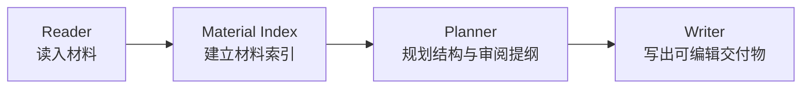
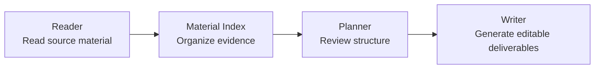

<div align="center">

# 卡布奇娜 · Kabuqina

**面向学生场景的 Windows 学术助手 Agent**
Reader -> Material Index -> Planner -> Writer 四层框架 · 自带桌面壳 · BYO API Key · 本地凭据与工作区安全

[](#安装与运行)
[](https://tauri.app/)
[](https://react.dev/)
[](https://www.python.org/)

</div>

---

## 简体中文

> 当前分支：`codex/student-deliverables`。这个分支不是通用聊天壳展示，而是把卡布奇娜收束成**学生可交付物导向的学术助手 Agent**：帮助学生读懂资料、整理证据、规划作业/汇报结构，并产出可以继续修改和提交的文件。

### 一句话

卡布奇娜在这个分支中的核心目标是：**把论文、课件、代码、公式、语音笔记等学习材料，转化为课程报告、文献汇报、答辩 PPT、公式说明和代码解释等学生交付物。**

它仍然是 Windows 桌面应用，但产品主线已经从“连接一个 agent”升级为“为学生搭一条从阅读到写作的学术工作流”。

### 这个分支面向的学生场景

- **课程报告与作业**：读取 PDF、DOCX、PPTX、Markdown、代码片段等材料，整理成报告提纲、要点、引用依据和可写入内容。
- **文献阅读与论文汇报**：抽取论文结构、公式、图表和关键结论，生成汇报大纲或课堂展示 PPT。
- **课程/项目答辩 PPT**：围绕材料建立索引，先审阅提纲，再写出 `.pptx`，适配课程汇报、论文精读、代码答辩。
- **数学公式与表达式处理**：从公式密集文档中提取 LaTeX；候选能力覆盖公式清洗、公式转代码、代码转数学表达说明。
- **编程课与实验报告**：面向 Python、NumPy、C++17 等常见学生代码任务，辅助解释实现思路、整理算法表达与报告材料。
- **学习输入通道**：支持本地文件、语音转写能力包、消息平台入口与桌面工作区，让学生从自己的材料开始，而不是从空白对话开始。

### 产品能力地图

| 能力 | 学生能拿它做什么 | 当前状态 | 所在层 |
| --- | --- | --- | --- |
| 精确文档读取 | 读取 PDF、DOCX、PPTX、XLSX、HTML、Markdown、CSV、图片和文本，保留更可靠的结构信息 | 已接入能力注册 | Reader |
| 公式抽取与 LaTeX | 从公式密集材料中抽取数学表达，整理为 LaTeX/Markdown 可用内容 | 需要 `docling-codeformula` 能力包 | Reader |
| 本地语音识别 | 把课堂录音、口述笔记或讨论内容转成文本材料 | 需要 `local-stt-base-q5_1` 能力包 | Reader |
| 学生 PPT 工作流 | 从课程/论文/代码材料生成汇报 PPT：读材料、建索引、审提纲、写 `.pptx` | 已作为学生交付物工作流登记 | Reader -> Writer |
| 材料索引 | 把原始材料拆成可引用、可追踪的事实、公式、表格、代码和论点 | 产品主线能力 | Material Index |
| 提纲审阅 | 在写文件前先给出结构、假设和待确认点，降低“直接胡写”的风险 | 产品主线能力 | Planner |
| 文件写出 | 输出 PPTX、Markdown、LaTeX、报告草稿或代码说明等可继续编辑的文件 | 产品主线能力 | Writer |
| 数学表达工程 | 公式清洗、公式转 Python/NumPy/C++17、代码转公式说明和报告 | Candidate，仅作分支方向声明 | Reader -> Writer |
| 桌面安全与凭据 | API Key 进 Windows Credential Manager，工作区隔离，loopback 通信 | 已落地 | Desktop Shell |
| 消息平台入口 | 飞书、QQ、微信、企微、Email 等平台配置入口，用于后续提醒和消息投递 | 桌面入口已接入 | Integration |

### Reader 到 Writer 的四层框架

这个分支最重要的产品骨架是四层学术交付框架。每一层都对应学生从“资料很多”到“能交一个东西”的一步。



| 层级 | 责任 | 典型输入 | 典型输出 |
| --- | --- | --- | --- |
| **Reader** | 精读文件、公式、语音、图片和代码，尽量保留结构与来源 | 论文 PDF、课件、Word、表格、截图、录音、代码 | 文本块、公式、表格、章节、转写文本 |
| **Material Index** | 把材料整理成可检索、可引用、可追踪的索引 | Reader 输出的原始结构 | 证据地图、公式表、术语表、源位置、主题分组 |
| **Planner** | 决定交付物结构，暴露假设和待确认点，让学生先审阅再生成 | 材料索引、作业要求、汇报场景 | 报告大纲、PPT 章节、论证路径、待补充清单 |
| **Writer** | 生成可继续修改的文件，而不是只停留在聊天回复 | 已确认提纲、模板、材料引用 | `.pptx`、Markdown、LaTeX、报告草稿、代码说明 |

这个框架让卡布奇娜不只是“回答问题”，而是能围绕学生交付物组织工作：先读清楚，再建索引，再规划，最后写出文件。

### 已突出能力与候选能力

**已作为分支主线突出的能力**

- 学生学术助手定位：课程报告、论文阅读、PPT 汇报、代码答辩和公式材料处理。
- 学生 PPT 交付流：`reader -> material_index -> planner -> writer`。
- 能力包机制：较重的公式识别、本地语音等能力以 load package 方式开启，避免默认包过重。
- 桌面安全模型：Windows Credential Manager 保存 API Key，Python 子进程只通过 loopback 与 Tauri 通信。
- Onboarding 简化：直接 Quick Start，降低学生首次启动成本。
- 消息平台名称统一：设置和 onboarding 中使用一致的平台命名。

**Candidate / 方向性能力**

- 公式清洗：把 OCR、文档、LaTeX、代码中的混乱数学表达整理成干净 LaTeX/Markdown。
- 公式转代码：把数学公式或文档公式转成 Python、NumPy 或 C++17 实现草稿。
- 代码转公式：把 Python/NumPy/C++17 实现解释成数学表达、LaTeX、Markdown 或报告片段。

Candidate 能力代表这个 branch 的产品方向；只有当执行管线、状态上报、测试和 prompt contract 都补齐后，才应在 UI 中标为可用能力。

### 本分支交付内容

- **学生化 README 与产品定位**：明确这是学生学术助手 agent 分支，而不是抽象桌面包装。
- **简化 onboarding**：移除 Full Setup 路线和模式选择，首次启动直接进入 Quick Start。
- **设置与 onboarding 文案统一**：消息平台名称统一为面向用户的中文平台名，跳过入口更明确。
- **能力页与能力注册表**：以 capability registry 描述 Reader、Material Index、Planner、Writer 层能力。
- **桌面运行骨架**：Tauri 2 + React/Vite + Python child + Hermes core。
- **凭据与安全**：BYO API Key，密钥进入 Windows Credential Manager，不写入普通配置文件。

### 截图

> 如果仓库中没有截图文件，可以先运行应用并补充 `docs/screenshots/`。

<p align="center">
  
</p>

<p align="center">
  
</p>

<p align="center">
  
</p>

### 安装与运行

#### 从源码运行

前置要求：

- Windows 10/11
- Rust 1.80+
- Node.js 20+
- PowerShell 7+

```powershell
# 1. 构建 Python bundle
.\python\build_bundle.ps1

# 2. 构建 Web shell
cd web
npm ci
npm run build
cd ..

# 3. 启动开发环境
.\scripts\dev.ps1
```

#### Release 构建

```powershell
.\python\build_bundle.ps1 -Verify
cd web
npm ci
npm run build
cd ..
cd tauri
cargo tauri build
```

生成的安装包通常位于：

```text
tauri/target/release/bundle/msi/
```

### 配置

首次启动时，Quick Start 会引导学生完成最少必要配置：

1. 选择或确认工作区。
2. 配置 LLM Provider 和 API Key。
3. 按需进入设置页启用能力包或消息平台。

密钥存储方式：

- API Key 存入 Windows Credential Manager。
- 明文 key 不写入仓库、配置文件或日志。
- Python 子进程启动时通过 Tauri loopback bridge 获取密钥。

### 消息平台与提醒

消息平台配置入口面向后续的提醒、投递和学习工作流通知。当前桌面主线使用的用户可见平台名称包括：

- 飞书
- QQ
- 微信
- 企微
- Email

### 能力与边界

卡布奇娜适合：

- 课程论文、课程设计、实验报告和课堂汇报。
- 论文精读、文献综述和公式解释。
- 从材料生成 PPT、提纲、Markdown 草稿和代码说明。
- 在本地 Windows 桌面中管理工作区、凭据、能力包和消息入口。

卡布奇娜不适合：

- 自动代替学生完成学术判断、实验真实性或最终署名责任。
- 绕过课程、学校或期刊的学术诚信要求。
- 在没有材料依据时伪造引用、实验数据或结论。

建议把它当成“能读材料、能整理、能起草、能生成文件的学习协作者”，而不是无需审阅的自动交付机器。

### 技术结构

```text
Tauri 2 shell (Rust)
 ├─ Web shell (React/Vite, web/)          onboarding, chat, settings, capability UI
 ├─ Python child: desktop_entrypoint.py   Hermes web_server on loopback
 └─ Python child: gateway.run             optional messaging adapters
```

重要目录：

| 路径 | 作用 |
| --- | --- |
| `web/` | 学生面向的桌面 Web shell、onboarding、chat、settings |
| `python/src/` | 桌面服务、能力状态、policy layer、loopback API |
| `python/overlays/` | Hermes 集成胶水、工具策略、审批桥、桌面行为 |
| `hermes_core/` | 自有 agent core、工具、cron、gateway、provider |
| `tauri/` | Windows 桌面壳、子进程监督、凭据与系统集成 |
| `docs/` | 架构、决策、用户研究、开发计划 |

### 常用开发命令

```powershell
# Web lint / build
cd web
npm run lint
npm run build
cd ..

# Python tests
cd python
python -m unittest discover -s tests -p "test_*.py" -v
cd ..

# Tauri dev
.\scripts\dev.ps1
```

### 参考文档

- `AGENTS.md`：仓库开发指南
- `hermes_core/AGENTS.md`：agent core 内部说明
- `docs/architecture.md`：总体架构
- `docs/safety.md`：安全模型
- `docs/troubleshooting.md`：排障
- `docs/user-research/`：学生场景反馈与产品依据

---

## English

> Current branch: `codex/student-deliverables`. This branch positions Kabuqina as a **student academic assistant agent**, focused on turning learning material into reviewable student deliverables.

### What This Branch Is About

Kabuqina is a Windows desktop agent for students who need help moving from raw material to finished academic work:

- reading papers, slides, documents, tables, images, formulas, audio notes, and code;
- building a structured material index with facts, formulas, evidence, and source positions;
- planning a report, presentation, literature review, or code-defense narrative before generation;
- writing editable deliverables such as `.pptx`, Markdown, LaTeX, report drafts, and code explanations.

The branch is not just a generic desktop wrapper. Its product thesis is: **a student agent should read, organize, plan, and write with a visible chain from source material to deliverable.**

### Student Use Cases

- Course reports and assignments.
- Literature reading and paper presentations.
- Course, project, and code-defense PPTs.
- Formula-heavy PDFs and LaTeX cleanup.
- Programming coursework explanations for Python, NumPy, and C++17.
- Local study workflows using desktop files, optional speech recognition, and messaging entry points.

### Four-Layer Framework



| Layer | Responsibility | Typical Output |
| --- | --- | --- |
| **Reader** | Parse documents, formulas, images, audio, and code while preserving structure | text blocks, formulas, tables, sections, transcripts |
| **Material Index** | Turn raw material into searchable and citeable evidence | evidence maps, symbol tables, source positions, topic groups |
| **Planner** | Create a reviewable outline before writing | report outlines, PPT sections, assumptions, missing-information lists |
| **Writer** | Produce editable files instead of stopping at chat answers | PPTX, Markdown, LaTeX, report drafts, code explanations |

### Capability Map

| Capability | Student Value | Status | Layer |
| --- | --- | --- | --- |
| Precise document reading | Read PDFs, DOCX, PPTX, spreadsheets, Markdown, HTML, CSV, images, and text | Registered capability | Reader |
| Formula extraction and LaTeX | Extract math expressions from formula-heavy material | Requires `docling-codeformula` load package | Reader |
| Local speech recognition | Convert lectures or spoken notes into text material | Requires `local-stt-base-q5_1` load package | Reader |
| Student PPT workflow | Read material, build an index, review an outline, and write `.pptx` | Student deliverable workflow | Reader -> Writer |
| Material indexing | Build traceable facts, formulas, terms, and evidence maps | Product-line capability | Material Index |
| Outline review | Confirm structure and assumptions before generation | Product-line capability | Planner |
| File writing | Generate editable academic artifacts | Product-line capability | Writer |
| Math expression engineering | Cleanup formulas, convert formulas to code, and explain code as math | Candidate direction | Reader -> Writer |
| Desktop safety | Store API keys in Windows Credential Manager and isolate workspace access | Implemented | Desktop Shell |
| Messaging entry points | Configure Feishu, QQ, WeChat, WeCom, and Email for later delivery workflows | Desktop entry points | Integration |

Candidate capabilities describe the branch direction. They should only be marked available in UI after executable pipelines, status reporting, tests, and prompt contracts are in place.

### Install And Run

Prerequisites:

- Windows 10/11
- Rust 1.80+
- Node.js 20+
- PowerShell 7+

```powershell
# 1. Build Python bundle
.\python\build_bundle.ps1

# 2. Build Web shell
cd web
npm ci
npm run build
cd ..

# 3. Start dev environment
.\scripts\dev.ps1
```

Release build:

```powershell
.\python\build_bundle.ps1 -Verify
cd web
npm ci
npm run build
cd ..
cd tauri
cargo tauri build
```

The installer is usually generated under:

```text
tauri/target/release/bundle/msi/
```

### Configuration

Quick Start guides students through the minimum required setup:

1. Choose or confirm a workspace.
2. Configure an LLM provider and API key.
3. Open Settings when optional capability packages or messaging platforms are needed.

API keys are stored in Windows Credential Manager and are fetched by the Python child process through the Tauri loopback bridge. Plaintext keys are not written to normal config files or logs.

### Project Structure

```text
Tauri 2 shell (Rust)
 ├─ Web shell (React/Vite, web/)          onboarding, chat, settings, capability UI
 ├─ Python child: desktop_entrypoint.py   Hermes web_server on loopback
 └─ Python child: gateway.run             optional messaging adapters
```

| Path | Purpose |
| --- | --- |
| `web/` | Student-facing desktop web shell, onboarding, chat, settings |
| `python/src/` | Desktop services, capability status, policy layer, loopback APIs |
| `python/overlays/` | Hermes integration glue, tool policy, approval bridge, desktop behavior |
| `hermes_core/` | Owned agent core, tools, cron, gateway, providers |
| `tauri/` | Windows shell, child supervision, credentials, system integration |
| `docs/` | Architecture, decisions, user research, development plans |

### License

See `LICENSE`.
