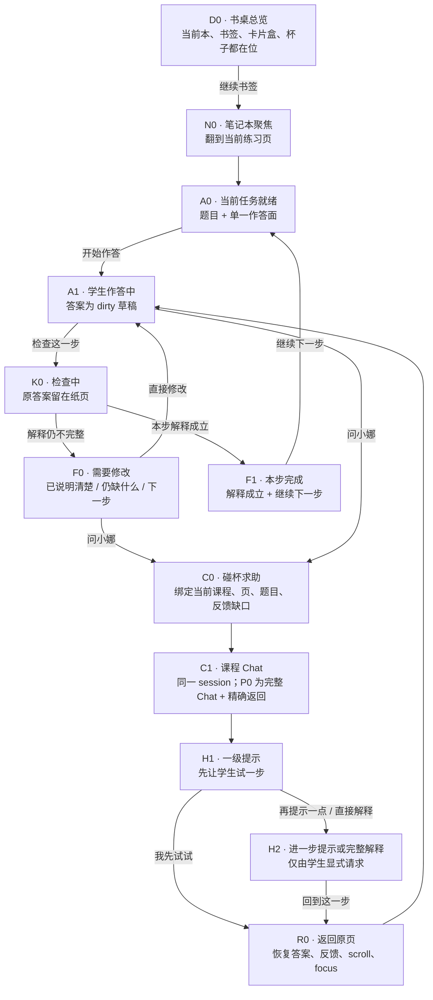

# v0.5.0 书桌学习 Canonical Screen / State Flow

> **日期：** 2026-07-19  
> **状态：** `CANONICAL FLOW PROPOSAL · READY FOR OWNER REVIEW · NOT IMPLEMENTATION FREEZE`  
> **上游：** [书桌学习体验校准 Brief](2026-07-19-v0.5.0-desk-experience-realignment-brief.md)  
> **范围：** 一名学生从书桌继续当前练习，作答、检查、向小娜求助并回到原页继续学习。  
> **不包含：** 新母版、白板课、Create/成果详细工作流、Tutor 完整状态机或 production 组件拆分。

## 0. Canonical 体验承诺

> **学生坐下就能从书签继续；在笔记本里完成当前学习动作；检查后知道下一步；碰一下
> 咖啡杯，小娜带着当前页帮助；返回时，原来的纸页、答案和学习位置完整保留。**

本流程只承认一个学习现场：当前课程笔记本中的当前页与当前 activity。Chat、sidecar、
full route、页边提示只是同一现场的不同 presentation，不建立第二份课程、答案、会话、草稿、
pending 或 return 真值。

## 1. 主流程



### 这张图锁定的三件事

1. **检查反馈留在笔记本。** Chat 不承担 grader/result surface；
2. **小娜默认先递提示。** 完整解释仍可显式取得，但不默认抢答；
3. **帮助必须回到动作。** 每条辅导路径最终回到同一答案或下一学习步骤。

## 2. 状态不是一个巨型 enum

界面由五个正交维度组合，不建立 `scene_state = chat | practice | feedback` 这类互斥总状态：

| 维度 | Canonical 值 | 真值/说明 |
|---|---|---|
| `deskDensity` | `overview / focused / deep` | 只控制书桌物件的空间密度，不改变对象身份 |
| `studyActivity` | `ready / dirty / checking / needs_revision / completed / error` | 当前 Study activity / answer / grader 真值 |
| `nanaPresence` | `idle / invoked / responding / unread / blocked` | 杯子与 Chat 的可见在场状态，不等于学习结果 |
| `chatPresentation` | `closed / full / sidecar? / narrow_full` | presentation；`sidecar` 仍需 E3/E4 采纳 |
| `sessionContinuity` | `same_context / exact_return / target_missing` | 同一 session/context/return 合同 |

例如“学生正在修改答案，同时小娜有未读回答”是合法组合：

```text
deskDensity=focused
studyActivity=dirty
nanaPresence=unread
chatPresentation=closed
sessionContinuity=same_context
```

杯子可以显示一次轻微热气变化与“有新回答”文字，但不得替换学生正在编辑的答案、当前
反馈或主动作。

## 3. Canonical Screen Matrix

| ID | 学生看到什么 | 唯一主动作 | 稳定桌上物件 | 必须保留的状态 | 进入焦点 | 离开/返回合同 |
|---|---|---|---|---|---|---|
| `D0` 书桌总览 | 当前本、露出的书签、当前课材料、due 卡片盒、工作夹、杯子 | `继续：练习 3 · 第 2 步` | 四件母版全部可见 | current space、resume target、due、Activity 摘要 | 书签/继续动作 | 无 dirty 时进入当前本；不可静默挑另一个 activity |
| `N0` 笔记本聚焦 | 本子扩大，当前页打开；桌边物件退让但不消失 | `开始/继续这一步` | 书堆、卡片盒、杯子仍在桌边 | lifecycle page、semantic scroll anchor | 当前页标题 | 返回总览恢复书签；换页走统一 dirty guard |
| `A0` 任务就绪 | 题干、完成标准、与本题绑定的折叠参考、一个作答面 | `开始作答` 或直接聚焦答案 | 杯子可用；卡片盒安静 | activity ID、题型、answer schema | 题目标题后进入作答面 | 不并排展示其他题型 inventory |
| `A1` 作答中 | 学生深墨/草稿答案、保存说明、折叠参考 | `检查这一步` | 杯子可用 | dirty answer、revision、local save/recovery truth | 答案输入 | Chat handoff 不清空答案；换页/back 走 dirty guard |
| `K0` 检查中 | 原答案不动；纸页出现轻量“正在检查”状态 | 当前动作原位变为 `正在检查…` | 其他物件不闪动 | pending、cancel/timeout/error truth | 保持原动作位置 | 不跳 Chat、不滚页顶、不用 toast 代替结果 |
| `F0` 需要修改 | 纸页反馈分成“已经说明清楚 / 还差一步 / 接下来试试” | `修改答案` | 杯子在反馈旁可被调用 | learner answer、grader truth、semantic suggestion 分层 | 原动作位置变为 `修改答案` | 修改回 `A1`；问小娜携带具体 feedback gap |
| `F1` 本步完成 | 正确部分、简短解释、下一学习目标 | `继续下一步` | 卡片盒/due 不抢主动作 | completed evidence、next target | 原动作位置变为 `继续下一步` | 下一步仍在同一本；无 next 时进入有界总结 |
| `C0` 碰杯求助 | 杯子回应；显示“结合练习 3 · 第 2 步问小娜” | `开始提问` | 当前本保持可识别 | context/return preview、provider readiness | composer 或明确 blocked action | 取消恢复杯子 invoker；不创建普通无上下文 Chat |
| `C1` 课程 Chat | 课程/页/题目 chip、同一 transcript、composer、明确返回 | `发送问题` | P0 full 时书桌退为边缘 return anchor | same session、draft、pending、semantic message anchor | composer；blocked 时恢复动作 | P0 走 exact return；sidecar 只是同一状态的可选呈现 |
| `H1` 一级提示 | 小娜确认卡点，只给当前可尝试的一步 | `我先试试` | 无新增家具 | hint level、message ID | 消息区/composer 合同不变 | 回原页时建议可短暂成为页边提示，不写入答案 |
| `H2` 深入帮助 | 第二提示或完整解释；明确由学生请求 | `回到这一步` | 无新增家具 | requested help level、message ID | 返回动作 | 不自动判题、不自动修改 Study truth |
| `R0` 精确返回 | 同一题、同一答案、同一反馈；页边短提示指向下一动作 | `继续修改` 或 `继续下一步` | 四件关系恢复 | page + activity + focusId + semantic offset + dirty/pending | 原答案/反馈动作 | return target missing 时解释并回当前课程安全页 |

## 4. 笔记本内部构图合同

### 4.1 Focused notebook 的阅读顺序

```text
课程与当前页
  → 当前任务/完成标准
  → 题干
  → 学生作答面
  → 检查状态与反馈
  → 修改或继续
```

“本题参考”是页边折页/夹页，默认不插入上述主阅读链。选择题、判断题、简答、代码、推导
属于题型 inventory，但每一个 activity frame 只展开当前真实作答面。

### 4.2 检查反馈的纸页结构

`F0 · needs_revision`：

```text
我的答案（保持可见）

页边批注
✓ 已经说明清楚：代入后得到 0/0。
○ 还差一步：说明 0/0 是未定式，不是极限值。
→ 接下来试试：把这句话补进你的解释。

[修改答案]   [问小娜]
```

`F1 · completed`：

```text
我的答案（保持可见）

页边批注
✓ 这一点已经说明清楚。
  你区分了“得到未定式”和“得到极限值”。

[继续下一步]
```

规则：

- 确定性 grader 决定 pass/fail；小娜/语义模型只能解释或给建议；
- 不显示只有“已检查”的空结果；
- 反馈不覆盖答案，不自动改写答案；
- 动作控件保持同一 DOM/视觉位置，pending/result 切换不让键盘焦点掉到 `body`；
- 结果通过独立 polite status 宣布，但不把整段反馈反复作为 live region 播报。

## 5. 咖啡杯与小娜的介入合同

### 5.1 杯子是稳定本体

- 宽屏固定在桌面右下，与右上卡片盒形成稳定上下关系；
- 外层是可聚焦原生 button，始终有可读“问小娜”；
- 热气、光斑和轻微回应是 `aria-hidden` 氛围；
- `idle / responding / unread / blocked` 必须同时有文字或标准状态等价；
- active activity 中不把杯子移动到题目上，也不弹出抢占焦点的自动建议。

### 5.2 Hint ladder

| 层级 | 小娜做什么 | 不做什么 | 返回动作 |
|---|---|---|---|
| `H0` 确认卡点 | 复述当前题与学生具体困惑 | 不泛讲整章 | `是这里 / 换个问题` |
| `H1` 一级提示 | 提供一个观察方向或问题 | 不直接写完整推导 | `我先试试 / 再提示一点` |
| `H2` 二级提示 | 给结构、关键变形或局部示范 | 仍不自动写入答案 | `回去完成 / 看完整解释` |
| `H3` 完整解释 | 仅在学生显式请求时给完整推导/答案 | 不替代检查结果，不激活学习事实 | `回到这一步` |

学生可以随时显式选择完整解释，不强制线性闯关；默认顺序只确保小娜先帮助学生继续思考。

### 5.3 Presentation 裁决

P0 canonical shipping flow：

```text
杯子 → 完整 course Chat → exact return
```

wide sidecar 仍是 presentation enhancement，只有同时满足以下条件才可进入：

- 复用同一 session/context/transcript/composer/pending/scroll anchor；
- Chat 保持约 360–420px 可用宽度；
- 当前题干、答案、反馈和主动作仍可读、可操作；
- 不产生第四列、第二 composer、第二 draft 或 mini-chat；
- 关闭/展开/full/return 的焦点和 semantic scroll 连续性通过；
- E3 学生测试显示它比 direct full 更容易继续学习，并由 E4 明确采纳。

因此 `overlay / compress` 不是两条产品流程，只是同一 `C1` 状态的候选呈现。

## 6. 空间与动效连续性

| 转换 | 普通动效语义 | reduced-motion 等价 | 不允许 |
|---|---|---|---|
| `D0 → N0` | 当前本向主舞台展开；书签成为页内锚点；边侧物件轻退 | 直接重排并保留焦点 | 新建另一套页面、全屏闪白 |
| `A1 → K0 → F0/F1` | 反馈像页边落下一条批注；答案位置不动 | 反馈直接出现 + status | toast 代替结果、整页跳顶 |
| `A1/F0 → C0` | 杯子轻微回应；当前本保持可识别 | 仅状态文字变化 | 自动打开 Chat、循环动画 |
| `C0 → C1` | 书桌退为边缘背景与 return anchor | 直接进入完整 Chat | 把课程上下文替换为普通 Chat |
| `C1/H* → R0` | 逆向回到同一本同一纸页；页边短提示对齐原缺口 | 直接恢复精确 anchor | 只回 `/practice` 顶部、丢答案/scroll |

动效参数由已通过 Style Tile 与 V-1 token 冻结，不在本流程另造时间、曲线或颜色。

## 7. Focus / Keyboard / Announcement Map

| 事件 | 焦点合同 | 播报合同 |
|---|---|---|
| 从书签进入 | 当前页标题，随后自然进入作答面 | 页名与当前任务 |
| 点击检查 | 原动作保持 DOM 位置；状态切为 checking | `正在检查这一步` |
| 检查完成 | 同一动作位置变为“修改答案”或“继续下一步” | 一次宣布 `需要修改` 或 `本步完成` |
| 点击杯子 | 正常进入 composer；blocked 进入恢复动作 | 当前课程、页与题目 context |
| 发送问题 | textarea 触发不强夺焦点；按钮触发可交给 Stop | `小娜正在回答`，不逐 token 播报 |
| Stop | partial 保留；焦点回发送动作 | `已停止，已保留当前回答` |
| 关闭 presentation | Escape 只关闭最内层 presentation，不等于 Stop | 无额外冗长播报 |
| exact return | 恢复 `focusId + semantic offset`；优先答案/反馈动作 | `已返回练习 3 · 第 2 步` |
| target missing | 聚焦解释与安全返回动作 | 原位置不可恢复及原因 |

## 8. Responsive Translation

| 宽度/模式 | 书桌与本子 | 小娜 | 不变的主任务 |
|---|---|---|---|
| Wide overview | 完整四件母版；本占主舞台 55–65% | 右下杯 | 书签继续、due、材料、工作夹均可发现 |
| Wide focused | 本子扩大；边侧物件退到桌边 | 杯仍在位；P0 full，sidecar 待门 | 当前题、答案、反馈完整 |
| Medium | 对象关系收紧；本优先；工作夹成本下横条 | P0 使用完整课程 Chat + return；drawer 另过门 | 当前 task 与 return 一步可达 |
| Narrow / 200% | 语义 flat flow：context → task → due → supporting entries | 完整 Chat route | 不丢材料、制作/成果、Chat 与 dirty guard |
| 读屏 | 固定 DOM 顺序，不朗读装饰 | `问小娜`标准按钮与 course context | 与视觉用户完成同一作答/检查/返回流程 |

## 9. 下一轮 Canonical Prototype Frame Set

原型控制层与产品画布必须分离。产品截图裁切后不得出现 `BASELINE INHERITED`、route、
fixture ID、source_refs 或 candidate 说明。

| Frame | 必须展示 | 主要验收 |
|---|---|---|
| `C-D0` | 回访学生的完整书桌总览 | 5 秒指出当前本、书签、due、杯、工作夹 |
| `C-N0` | 当前本聚焦后的练习页 | 边侧物件退让但仍可发现 |
| `C-A1` | 学生正在写一句解释 | 单一作答面、答案为视觉主体 |
| `C-F0` | 检查后需要修改 | 三段反馈 + 原地修改 + 问小娜 |
| `C-C0` | 杯子被调用、上下文确认 | 杯子本体与 course/focus/return 一致 |
| `C-H1` | 小娜给一级提示 | 不直接给答案，明确“我先试试” |
| `C-H2` | 学生显式请求完整解释 | 完整解释与返回动作清楚 |
| `C-R0` | 精确返回原答案与反馈 | 答案、scroll、focus、页边短提示完整 |
| `C-F1` | 修改后通过并继续下一步 | 学习闭环，不停在“已检查” |
| `C-NARROW` | 720px / 200% task → Chat → return | 无横向溢出、无核心动作丢失 |

## 10. 原型验收脚本

一名未参与设计的学生应能在无口头说明下完成：

1. 从书桌指出当前课程、上次学到哪里、今天是否有复习；
2. 从书签进入练习并写下一句解释；
3. 检查答案，说出自己哪里正确、哪里需要修改；
4. 在不知道下一步时通过杯子问小娜；
5. 收到一级提示后选择先自己尝试；
6. 回到原答案并完成修改；
7. 再次检查并进入下一步；
8. 全程不丢答案、会话、生成状态、scroll、focus 或课程绑定。

失败条件：

- 把卡片盒、Activity、工作夹或 Chat 当成当前作答主任务；
- 点击检查后只看到“已检查”；
- 小娜默认直接替学生写完整答案；
- Chat 覆盖答案且无法同时阅读，或返回只到页面顶部；
- sidecar/full/direct 产生两份 transcript/composer/pending；
- 需要解释内部术语、route、fixture 或数据字段才能完成；
- 200%/键盘/读屏路径丢失核心动作。

## 11. 本流程完成门

- [ ] owner 确认 `D0 → N0 → A0/A1 → K0 → F0/F1 → C0/C1/H* → R0` 主循环；
- [ ] 确认检查反馈三段式与“修改/继续”动作；
- [ ] 确认 hint ladder 默认节奏与显式完整解释；
- [ ] 确认 direct full Chat + exact return 继续作为 P0 canonical flow；
- [ ] 确认 sidecar 只是一种待门 presentation，不是第二条流程；
- [ ] 确认 responsive、focus、announcement 与 target-missing 合同；
- [ ] 再交给原型 session 产出上述 10 个 frame 和浏览器证据；
- [ ] 行为确认后才叠加 Style Tile CSS 美术并进入 V 轨视觉冻结。

