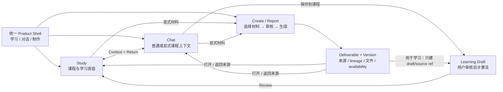

# v0.5.0 产品全景与体验架构计划：Study-first、Chat 与 Create/Report

> **性质：** 版本级产品体验架构（Product Experience Architecture，E 轨）。本文先冻结
> Kabuqina 作为**一个产品**时的承诺、一级信息架构、领域职责、共同对象、跨面往返和
> 成熟度门，再由 UX、UI 与功能切片分别落实；不授权把全产品重写成一个 mega diff。
>
> **状态：** Draft v4 + implementation status note（2026-07-23）。这是 v0.5.0 Study 详细 UX、全局 UI 美术和
> Chat/Study/Create 跨面实现的共同上游。Gate E4 前，不把当前 Chat 右栏或独立 Study
> 页面直接美化成最终产品结构；已冻结的 Tutor、Practice、Learning contracts 可并行推进。
>
> **E3 seed 与当前实现状态：** [canonical Study 书桌原型](../prototypes/2026-07-23-v0.5.0-desk-canonical.html)
> 已由 owner 冻结行为并在 `d529dc4e` 固化，`CTL-A01 DONE`。React rescue 与真实
> `/study/:spaceId/practice` integration 已完成作者侧实现、自动化和浏览器冒烟，当前记为
> `CTL-A06a REVIEW · P3 FOLLOW-UPS · NOT DONE`；两轮独立 Review
> 已关闭 P1/P2，durable commits `42a7eccf`、`1198915b`、`887078d6` 已形成并排除 C 轨
> manifest；production
> fixture cleanup 与真实 Tauri 人工矩阵阻止 DONE/更高 Gate，见
> [production review handoff](../handoffs/2026-07-23-v0.5.0-study-desk-production-review.md)。
> 这不关闭 E3/E4/X4，也不把当前 `/chat` 跳转写成 E-I2 exact return。只有明确标为
> `OWNER-FROZEN/FROZEN-SPEC` 的事实可直接复用；`TO-TEST/OPEN` 不变，production slice
> 必须经过独立 Review、真实 Tauri 路由/功能验收和对应 Gate。
>
> **场景权威边界：**
> [书桌·笔记本·白板课·咖啡杯愿景](../specs/2026-07-06-desk-notebook-frontend-vision.md)
> 已由 owner 确认，拥有场景隐喻、基础物件位置和视觉母语。E 轨只补全 Chat/Create/成果
> 接入、context/return 和产品 chrome，不得反向重排既有书桌母版。

## 0. 决策摘要

### 0.1 一句话产品承诺

> **Kabuqina 是以 Study 为长期主线、以小娜 Chat 为贯穿式交互层、以
> Create/Report 为成果工作流的学生桌面助手。**

v0.5.0 推荐采用 **“两个一级目的地 + 一个上下文工作流”**：

- **学习（Study）**是默认主线和长期真值：课程、计划、活动、练习、复习、证据与评估；
- **对话（Chat）**是开放提问、探索、解释和调度入口；它可以是普通对话，也可以显式
  绑定某门课程或某个活动，但不凭隐式“当前课程”静默修改学习真值；
- **制作（Create/Report）**是从 Study 或 Chat 发起的有界工作流：显式选择材料，审核
  请求或故事板，生成 PPT/报告/文档，保存可找回成果，再回到来源；v0.5 不把它膨胀成
  第三个完整产品中心；
- **材料、草稿和成果关系**是三者共享的上下文层，不是第四个顶级 mode。

因此，当前 Chat 右栏里的 `WORK / REPORT / STUDY` 不再被视为目标 IA。它混合了：

- `WORK`：一次任务的瞬时状态；
- `REPORT`：启动动作；
- `STUDY`：持久产品领域。

目标 shell 的一级入口是**学习、对话**，另有显著但非一级目的地的**制作**动作；设置、
能力与超级用户入口归 utility navigation。若未来成果库、版本历史、生成 job 恢复和搜索
形成稳定独立领域，再评估把“成果”升级成第三个一级目的地。

### 0.2 “成熟产品”的定义

成熟不等于把功能清单做满，也不等于所有页面都有高保真背景。v0.5 只有同时满足以下
条件才算完整：

1. 首次用户知道产品首先帮助自己做什么，并能直接创建/选择课程开始学习；
2. 每个一级入口只有一个清晰职责，用户不会在 Chat、Study 和 Report 之间猜状态归属；
3. 从一个 surface 发起的任务能带着正确上下文到达、返回和在重启后恢复；
4. 普通 Chat 不会在用户看不见目标课程时读写学习真值；
5. 报告/PPT 不是聊天文本里偶然出现的文件路径，而是有来源、版本、状态和找回入口的成果；
6. 空态、dirty、pending、blocked、failed、offline、cancelled 和 restart 都有诚实结果；
7. 宽窗、窄窗、200% zoom、键盘和读屏路径都能完成相同主任务；
8. 可以删减场景华丽度和 Should 功能，但不能发布三个彼此不衔接的半成品 surface。

## 1. 为什么现有计划还不是产品全景

现有 v0.5 总计划已经覆盖 Tutor、Practice、Learning Space、裁剪、UX、UI 和兼容质量，
但这些是**工程交付轨**，不是用户眼中的产品结构。当前实现暴露出以下结构性冲突：

| 现状 | 用户风险 | v0.5 需要冻结的决定 |
|---|---|---|
| `/chat` 与 `/study/*` 是独立 route，但全局顶栏只有 Chat、Settings、Capabilities | Study 是主线却在全局导航中不可见，技术页反而与核心任务同权 | primary/utility hierarchy、默认落点与 active state |
| Chat 右栏把 WORK、REPORT、STUDY 做成同级 tab，默认 REPORT，出现文件后又 morph 为 WORK | 导航会随运行结果变形；领域、动作和状态无法区分 | 稳定 shell、上下文抽屉与 Create 入口 |
| 窄窗不渲染右栏 | Report 和 Chat 内 Study 入口实际不可达 | drawer/sheet fallback 与键盘合同 |
| Study 的“问小娜”和 Chat 的“打开 Study”只是裸 route 跳转 | 丢失课程、页面、题目、活动和返回位置 | versioned context + handoff + return contract |
| Chat 每轮读取全局 current space，知识点捕获也不显式传目标 space | 普通对话可能写入错误课程 | session-bound context 与显式保存目标 |
| Chat 的 WORK/outputs 通过消息文本正则猜 Windows 文件路径 | 成果无法稳定归属、找回、版本化或重生成 | persistent deliverable record |
| Study 有成熟 artifact/activity/review 数据，Chat sessions 与 workspace files 却没有共同索引 | 三套历史互不相认 | 最小跨域对象与真值所有权 |
| Onboarding 和根路由最终都落 Chat | 实际产品仍是 Chat-first，与 Study-first 版本承诺冲突 | Study-first entry resolver 与无课程空态 |

这不是单纯“换导航”的问题。若不先冻结对象归属和跨面合同，前端即使画出统一外壳，
仍会把隐式 current space、正则文件推断和无返回裸跳转包装成看似完整的 UI。

## 2. 目标用户、核心 Jobs 与优先级

v0.5 的主要用户是有具体课程、材料、练习和交付任务的学生。产品按下列 Jobs 排序：

| 优先级 | Job | 成功结果 | 主 surface |
|---|---|---|---|
| 1 | 我想持续学会一门课程，而不是只得到一次答案 | 知道下一步、能练习/复习、活动可恢复、证据可解释 | Study |
| 2 | 我卡住了，想让小娜结合当前内容解释或协助 | Chat 明确知道当前课程/题目，回答后能回原处 | Study ↔ Chat |
| 3 | 我有一个开放问题或临时任务 | 普通 Chat 不污染任何课程，可按需转入 Study 或制作 | Chat |
| 4 | 我要基于明确材料制作 PPT、报告或文档 | 请求可审核、生成可恢复、成果可找回并回到来源 | Create/Report |

“生成更多页面”“增加更多母版”“让所有 Chat 自动学习化”都不是北极星目标。版本范围冲突
时，依次保护：产品脊柱 → Study Must → 数据/升级安全 → 可发布视觉完整度 → Should 功能。

## 3. 四个体验层的职责

### 3.1 Study：长期学习真值

**负责：**

- course/space、学习设定、当前计划与下一步；
- Tutor/Practice/Review 活动及 checkpoint；
- quiz、flashcards、wrongbook、evidence、weak points、evaluation；
- learning draft 的预览、审核、激活、拒绝与来源；
- 从当前学习上下文发起 Ask Nana 或 Create。

**不负责：**

- 保存普通 Chat 的全部历史；
- 把任意 Report 成果自动计作 mastery、完成度或永久知识；
- 复制 workspace 文件内容或建立第二套生成器；
- 强迫所有普通任务先建课程。

### 3.2 Chat：贯穿式交互层

**负责：**

- 普通开放对话；
- 显式绑定课程、activity、artifact/source 后的上下文对话；
- 解释、探索、工具调度和启动结构化 Tutor/Create 流；
- 显示当前作用域、来源与返回动作；
- 将模型建议写成待审核 draft，而不是直接写成学习事实。

**不负责：**

- 以“最近选择的课程”替代 session 的明确作用域；
- 从自然语言猜测并静默改写 Study；
- 把消息文本或进度日志当作成果索引；
- 冒充 Tutor checkpoint、Practice grader 或 Report job 的真值库。

### 3.3 Create/Report：有界成果流

这里的 Report 是能力类别，包含 PPT、报告、文档等；用户侧主文案暂用“制作”，在 E1
可用性验证后冻结中英文 canonical copy。

**负责：**

- 从 Study 或 Chat 接受显式上下文与材料选择；
- 形成可复核的 request/goal/audience/style/source list；
- 展示生成、失败、取消、重试和完成状态；
- 产生有稳定 ID、来源、版本、文件与 generation manifest 的 deliverable；
- 打开成果、回到来源、按明确动作关联到课程。

**不负责：**

- 成为第三套通用聊天；
- 在 v0.5 建完整自由画布、全局素材库或 Report Center；
- 自动把生成内容激活成课程知识或学习进度；
- 用漂亮母版掩盖请求、来源、恢复和成果归属缺失。

**v0.5 格式边界：**

- P0 guided Create 只选 **PPTX** 作为 reference flow，因为现有产品已经有 PPT 目标、
  大纲审核、母版选择与 renderer；J4 release journey 以 PPTX 验收；
- v0.5 复用现有 goal/emphasis/master 与 outline review，补 activity/inputs/status/output/return；
  不借 U-24 实现 U-21 的新 PptRequest、逐页 storyboard、局部编辑或重生成；
- desktop host 内现有 DOCX/PDF/HTML 等 writer 成功输出仍必须进入 typed
  deliverable/version 索引，才能移除消息路径正则并从 Recent Outputs 找回；它们在 v0.5
  保持 Chat/tool flow，不承诺新的专属 request/review UI。host wrapper 在调用 writer 前
  预建最小 `CreateActivity/CreateAttempt`，失败/完成走同一 commit/reconciliation contract；
  若普通 Chat 调用没有完整 typed inputs，成果明确标 `provenance_state=partial`，不伪称
  与 guided PPT 同等可追溯；
- gateway child 的 writer 继续使用 gateway delivery/file 语义，不自动写 desktop
  Activity/Recent。只有显式、经 host 验证的 gateway→desktop import/projection 才建立 desktop
  record，且不得伪造共享 session、owner 或 course context；
- UI/release notes 只宣传实际完整的“制作演示文稿”流程，不用泛化“制作任意报告”暗示
  DOCX/PDF/HTML 也已具备同等 guided UX；
- terminal/code/image 等一般 agent 文件在 v0.5 仍作为 workspace files，可通过明确的
  “打开工作区”访问；未进入 tracked writer pipeline 时不伪造 deliverable provenance，
  也不再用消息文本正则冒充成果记录；
- v0.5.x 再逐格式决定是否复用同一 CreateActivity contract，不能靠一个泛型按钮把范围
  无限展开。

### 3.4 Shared context：关系层，不是第四个应用

共享层只保存“谁与谁有关”：当前作用域、材料稳定身份、来源、draft、deliverable、
handoff 与 return target。它不复制 Chat transcript、Learning artifact 或 workspace bytes。

## 4. 一级 IA 与统一 Product Shell

### 4.1 方案比较

| 方案 | 优点 | 主要问题 | v0.5 裁决 |
|---|---|---|---|
| 单一 Chat Workbench，右栏切 WORK/REPORT/STUDY | 改动看似最小 | 混合领域/动作/状态；窄窗不可达；Study 主线被降格 | 拒绝 |
| Study / Chat / Report 三个一级目的地 | 表面清晰 | Report 尚无独立历史、对象、搜索和恢复中心；容易扩大范围 | 延后评估 |
| **Study / Chat 两个一级目的地 + contextual Create** | Study 主线清楚；普通任务仍可用；Report 可形成完整往返而不造新应用 | 需要补 context、deliverable 与全局 shell | **v0.5 推荐** |

Gate E1 必须用低保真比较双 hub 与三 hub；除非证据显示用户无法发现/找回成果，否则
不在 v0.5 新造 Report 一级中心。

### 4.2 First Sight 合同：先看见一张正在使用的书桌

“Study-first”不能只体现为导航顺序。标准桌面窗口、100% zoom 的普通冷启动中，用户看到的
第一张完整内容画面必须继承 owner 已确认的
[书桌·笔记本·白板课·咖啡杯愿景](../specs/2026-07-06-desk-notebook-frontend-vision.md)：
左桌角书堆、中央摊开笔记本、右侧卡片盒、右下小娜杯，第一眼优先读到书签和到期徽标。
本计划不再提出另一套“中央本/左右域”概念，只为该母版补全产品级入口、context 与 return。
它不是新增 `/home` 或 `/desk` hub，也不能为此新建 Dashboard 数据模型。

Create/Report 只共用一只从笔记本前缘/下层露出的薄工作夹，不挪走卡片盒，也不增加独立
成果托盘或 Activity 家具；进入活动时从 overview 逐级聚焦：

```text
┌ Kabuqina ─ 当前课程/普通任务 ─ 待处理/生成状态 ─ utility ┐
│                                                          │
│  [书立/新本]     ┌──── 打开的课程笔记本 ────┐  [卡片盒]   │
│  [桌角书堆]      │ 书签 / 五页 / 下一步      │  到期复习   │
│  本课已引用材料  │       STUDY 主舞台         │             │
│                  │ 页边小娜 / 错题与学习日志  │             │
│                  └────────────────────────────┘╲            │
│                   [工作夹：＋制作 | 成果]       [☕ 问小娜] │
├ 学习 ─ 对话 ─ ＋制作 ─ 活动/成果 ─────────── desk edge ┤
└──────────────────────────────────────────────────────────┘
```

空间位置表达职责和关系，但不替代文字、焦点与数据合同：

| 书桌区域 | 产品语义 | 点击/展开 | 不能暗示 |
|---|---|---|---|
| 中央打开的笔记本（约 55–65% 主舞台） | 当前 `Course/Space` 与 Study 生命周期 | 打开/聚焦本内页面；书签进入真实 next/resume | 可自由手写、虚构页数或按厚度表示进度 |
| 左后书立/空白本 | 课程切换与新建课程 | 打开真实 space switcher；dirty guard 后换本 | 与书堆合并成一个含混入口、任意拖拽排序或归档能力 |
| 左桌角书堆 | 当前课程 READ/知识库；P0 展示可证明的**已引用材料** | 从该 space 的 canonical artifact/draft `source_refs` 聚合只读 summary；展开 Materials section | 未关联 WorkspaceSource、全局素材库、搜索或自动移动文件 |
| 右上卡片盒 | 当前 space 的 flashcard due 队列 | 徽标显示真实到期量；打开本课复习 | 跨课程总数、装饰盒或被 Create 状态替换 |
| 右下小娜杯 + 文字标签 | Chat 入口 | 从 Study 打开显式 course Chat；v0.5 baseline 为 direct full Chat + 精确返回，wide sidecar 仅在共享状态证据通过且被 E4 采纳后作为渐进增强 | 仅靠冒热气表达状态、暗示 voice/六态已实现，或把 sidecar 当成已经冻结 |
| 笔记本前缘/下层工作夹 | **Create 动作与 Report/成果对象** | “＋制作”启动 PPT Create；“成果”打开最近 `DeliverableRecord`；显式 selected activity 才显示详情，否则只显示最高优先摘要+数量 | 两件新家具、静默把最新任务当当前、第三个 hub 或自动写入 Study |
| 顶部 product chrome | `ActivitySummary` 查询投影 | 打开全局 Activity/Recent，处理 waiting/blocked/retry；工作夹可镜像数量 | 另一张桌上票据、文件柜或把系统状态当课程内容 |

这里把 **Create 与 Report 放在同一只次级工作夹**：Create 是“夹入一张新 brief 并开始
制作”的动作，Report/成果是同一工作夹里的完成页签。它从笔记本下层露出，但不覆盖本页、
书签或右侧卡片盒。两者不是同级 hub，也不与 Study/Chat 组成四栏导航。产品文案优先使用
“制作”和“成果”，`REPORT` 只作为旧术语/领域说明，不再作为桌面 tab。

### 4.2.1 总览 → 工作面 → 深度活动

- **Desk overview：** 普通冷启动、返回桌面、课程切换后先显示全部稳定锚点与一个真实
  下一步；不把每个任务散成便签；
- **Focused work surface：** 点笔记本后中央本放大，书立/书堆/卡片盒退为边缘；点杯子后
  baseline 打开带精确返回的完整 course Chat，只有共享状态证据通过且被 E4 采纳才在足够宽窗口翻译为
  360–420px contextual sidecar；点工作夹后打开可深链 Create 或成果 sheet/route；
- **Deep activity：** Tutor、Quiz、Whiteboard、完整 Chat 或 Create review/run 占据主舞台，
  书桌退成克制背景/边缘锚点；始终有“回到书桌/返回来源”，不靠浏览器历史猜；
- **成果回桌：** Create 完成后，工作夹“成果”页签更新并保留来源/return；不会自动插入课程本；
- **同一语义真值：** 空间对象只是 semantic component 的宽屏排布。动效、SVG 或品牌资产
  失败时仍显示中性的书桌骨架，而不是退回旧 WORK/REPORT/STUDY Workbench。

E3 必须比较 contextual Chat sidecar 与“直接打开课程 Chat + 明确回到书桌”两种杯子行为。
若 sidecar 需要复制 session/composer 状态、破坏焦点或超过 v0.5 热文件预算，允许采用后者；
不允许降级成新建一个丢失课程/return 的普通 Chat。

在 E3 完成前，实施排序明确采用 **direct full course Chat + exact return** 作为低风险
baseline/fallback；sidecar 必须复用同一 Chat presenter/state contract 与同一份
session/context/transcript/composer/pending state，不要求跨 route 保持同一 DOM，但不得实现成
mini-chat、第二 session 或第二份草稿状态。

P0 只设计**一套共享构图**。以下五类是组合式视觉 fixture，不是互斥业务 state enum：
课程基础态与 Activity/Create/Deliverable/故障投影彼此正交，可以同时出现；不得让一个 fixture
覆盖另一个对象事实，也不为每类生产独立重资产插画。

| 首屏 fixture | 学习母版投影 | 产品增量投影 | 首要动作 |
|---|---|---|---|
| `empty`：首次或回访无课程 | 空白本/开新本；书堆与卡片盒保留可信空态，不伪造 space | 独立 Create/成果仍按真值显示；杯与工作夹可发现 | 开新本 |
| `course_clean` | 当前本 + 一个真实书签/下一步；卡片盒显示真实 due/empty | 工作夹和问小娜安静待命 | 继续/下一步 |
| `course_attention` | 书签、夹页或卡片盒徽标表达真实 resume/draft/due，不散落假便签 | chrome 显示最高优先 Activity 摘要+数量 | 继续/复习/处理 |
| `create_overlay` | 可叠加在任意课程基础态；本、书签与卡片盒不被任务覆盖 | 工作夹显示 selected 或最高优先摘要+数量；成果页签独立按真值更新 | 审核/选择活动/打开成果 |
| `safe_degraded` | stale/no-provider/service failure 的安全本或空桌；基础物件仍有文字等价 | 相关入口显示原因和恢复动作 | 重试/配置/选课，不循环 loading |

### 4.2.2 语义 Product Shell

- **Primary：** 学习、对话；宽屏既有桌上空间锚点，也有 desk-edge/chrome 的文字入口；
  两者指向同一 destination，在所有 route 上可见并有 active state；
- **Create：** 显著动作，宽屏对应工作夹的“＋制作”标签，并保留全局文字动作；可从当前上下文
  启动，但不是默认打开的右栏 tab；
- **Utility：** 设置、能力、Profile、帮助和超级用户工具，不与核心目的地同权；
- **Context indicator：** 始终显示“普通任务”或“课程：名称”，需要时再显示 activity/
  artifact；切换必须显式且能解释影响；
- **Activity indicator：** 全局显示正在生成、等待输入、blocked、可恢复/可取消，不因换
  surface 消失；
- **Activity / Recent 入口：** shell 中必须有一个始终可达的最小入口；宽窗由 product
  chrome/desk-edge 入口打开 popover/drawer，工作夹只镜像相关计数，窄窗变 sheet/内部 route。
  它至少列出 running、
  awaiting-user、blocked、failed 和最近 completed。独立 Create 即使没有
  `space_id/session_id` 也能从这里找回。这不是完整 Report Center，不提供全局搜索、
  项目管理或素材库；
- **Context drawer：** 稳定分为当前上下文、材料、进度、成果；`WORK` 不再作为 mode；
- **Responsive：** 右侧抽屉在窄窗变成可发现的 sheet/route，绝不通过 `display:none`
  让核心能力消失；DOM、焦点与动作顺序在宽窄窗一致。

### 4.2.3 多任务与窄窗优先级

全局 activity 不能假设只有一个任务。E1/E2 必须冻结：

- 同时存在 Chat turn、Create、Tutor/Practice 和后台维护任务时的列表、计数与排序；
- waiting-for-user / blocked 优先于 running，running 优先于最近 completed；同级按更新时间，
  但任何任务都不能覆盖或删除另一任务的状态；
- primary indicator 只展示最高优先摘要，点击后打开完整 P0 activity list；
- 默认启动有多个 resumable activity 时展示选择面，不静默挑“最近一个”当赢家；
- 只有真正可恢复、可取消或需要用户处理的业务 activity 进入列表；纯 UI loading、toast 和
  短暂请求不伪装成持久任务；
- 窄窗/200% 下 `学习`、`对话`、`制作`、当前 context、最高优先 activity、return/back
  必须直接可见或一步可达；utility 可以进入 overflow；
- sheet/drawer 定义 focus trap、Esc、browser back、关闭后的焦点恢复和多 overlay 冲突；
  不得用另一个不可发现菜单替代当前被隐藏的右栏。

`ActivitySummary` 是查询 read model，不是新真值表：聚合 Learning activity、
`CreateActivity` 与仍存活的 in-memory Chat turn；每项保留 `source_kind + source_id` 并回到
原 owner。进程重启后普通 Chat turn 不伪装成可恢复，只有持久 activity 可进入 resume list。

### 4.3 route 与恢复原则

E1/E2 冻结实际 route；目标语义至少包括：

- `/study/:spaceId/:page`：课程长期 surface；
- `/chat/:sessionId?`：普通或已绑定上下文的会话；
- Create 可采用可深链的 `/create/:activityId` 或等价 overlay route，但必须能刷新/重启恢复；
- Create 中必须显示来源 breadcrumb/return；E1 冻结其打开时哪个 primary 保持 active，
  不能让 Study 与 Chat 同时假装 active，也不能把 Create 偷升为第三个 hub；
- 单个成果必须有稳定打开目标；是否公开 `/deliverables/:id` 由 E2 决定；
- `returnTo` 是白名单化的内部 route descriptor，不接受任意 URL；
- 旧 `/chat`、`/study` 深链有明确升级与 safe fallback，不把不存在对象伪装成首页。

### 4.4 默认启动与首次进入

根入口不再无条件进入 Chat，也不把 Activity list 变成新的首页。先区分入口意图：

1. **显式 deep link/toast/用户固定 resume target：** host 验证目标后可以直达；失效则解释并
   回到对应课程的书桌或安全空书桌；
2. **普通 app-icon 冷启动：** 进入书桌 landing。若有一个可恢复 activity，在桌面显示一张
   recovery card；若有多个，只投影最高优先摘要与数量，用户从 Activity/Recent 选择，绝不
   静默挑“最近一个”直达；
3. **有 current space、状态干净：** 打开当前课程书桌，中央本显示一个真实“继续/下一步”；
   不自动恢复到最近 deep page、Tutor、未提交 quiz、dirty whiteboard 或业务 activity；
4. **无课程：** 进入空书桌；**开新本/创建课程**为唯一主动作，**先问小娜**为次动作；
5. **同一进程内返回/窗口恢复：** 只有已验证的 clean route 可恢复原位置；dirty/pending 仍走
   return/recovery contract；
6. 普通 Chat 和独立制作始终可达，但不抢占首次产品承诺。

不得因为“上次最后停在某个 route”就自动把用户送进已失效、失败或跨课程的上下文。
“Study 概览”优先复用现有 lifecycle 中已冻结的课程首页/下一步 surface；E1 不得只为
默认落点再新增一个 Home/Dashboard。

E1 必须冻结以下启动矩阵：

| 启动事实 | 安全落点/行为 |
|---|---|
| fresh install、无课程 | 空书桌；开新本为唯一主动作，可本地建课；Chat/Create 说明 provider 前置 |
| onboarding 完成、有课程 | 当前课程书桌 + 一个真实下一步，不再无条件 Chat 或 deep page |
| 一个 resumable activity | 书桌 recovery card；只有显式 deep link/固定偏好才直达 |
| 多个 resumable activities | 书桌显示最高优先摘要+数量，打开 Activity 列表选择，不以时间戳静默裁决 |
| target stale/deleted | 解释失效，进入原课程书桌/空书桌安全态，保留 tombstone |
| Study 可用、Chat/Create provider 未配置 | 本地 Study 仍可进入；模型动作是 blocked/configure，不是全产品不可用 |
| resume 查询/服务启动失败 | 进入可重试的空/当前课程书桌 safe shell，不循环 loading 或退回错误课程 |

## 5. 产品对象与真值所有权

### 5.1 真值表

| 对象 | 真值所有者 | 关键字段/关系 | UI 禁止做法 |
|---|---|---|---|
| Course/Space | `learning.db` / LearningStore | owner、space、current selection | 以 localStorage 或 route 之外的隐式值覆盖 |
| Learning Artifact/Draft | `learning.db` | kind、lifecycle、review、source refs | 把 Report 文件直接当 activated learning artifact |
| Study Activity | `learning.db` | plan/practice/review/tutor state、checkpoint | 以 Chat 文案猜 completed/resumable |
| Chat Session | `state.db` | transcript、title；通用 interaction/pending 现状仍是内存态 | 用 session category 代替课程绑定，或承诺不存在的持久 interaction history |
| SessionExperienceContext | `state.db`，v0.5 新桥 | general/study、space/focus、Study return、revision | 每回合临时读取全局 current space；把 Create run state 塞进 session |
| Workspace Source | workspace bytes + `state.db` metadata | workspace/source id、relative path、hash、mime、origin | 把普通素材目录塞进 LearningStore；只保存自由格式路径 |
| Create Activity | `state.db`，v0.5 新桥 | request、typed inputs、review、attempt/run state、Create return | 与最终文件共用一个含混 status；暗示进程重启可续算 |
| Deliverable Record | `state.db`，v0.5 新桥 | 逻辑成果、activity、lineage、current version、link state | 承担运行 job；从消息文本正则推断 WORK/outputs |
| Deliverable Version | `state.db` metadata + workspace bytes | immutable path/hash、renderer/manifest/audit、availability | 用 completed/failed 表达 missing/modified；覆盖旧版本 |
| Material Index | 可重建派生缓存 | source hash、解析结果 | 当作唯一业务真值 |
| React route/local state | 展示层 | panel、focus、未提交 UI draft | 保存跨重启业务归属 |

跨数据库引用使用不透明 ID 和应用层校验，不建立一个新的“大一统产品数据库”。文件缺失、
课程被删或旧 session 不可用时，记录保持可解释 tombstone/unsupported 状态，而不是静默改绑。

**Canonical naming：** 持久 session 绑定叫 `SessionExperienceContext`；跨对象只读引用叫
`ExperienceContextRef`；白名单内部返回描述叫 `ReturnTarget`；跨面调用叫
`HandoffCommand`。schema/API 字段使用 snake_case，TypeScript 只在 adapter 映射为
camelCase。`schema_version` 表示合同版本，`revision` 表示 CAS 修订，`version_id` 表示
不可变成果版本，三者不得再统称 `version`。

### 5.2 `SessionExperienceContext v1`

概念合同至少包含：

```text
schema_version
owner_id
session_id
mode: general | study
space_id?
focus_kind?: page | artifact | item | activity | source | deliverable
focus_id?
intent?: ask | learn | practice | resume
origin_surface
return_target?
revision
updated_at
```

- owner 由 host/runtime 注入，客户端与模型都不能声明其他 owner；
- 从 Study 点“问小娜”时，先创建/选择会话并固定 `space_id + focus + return_target`；
- Chat turn 以该绑定建立 `desktop_learning_scope`，不追随后来变化的全局 current space；
- UI 顶部显示 context chip；改绑、解除绑定或切课程是显式动作；
- 所有更新携带 `expected_revision` 并执行 compare-and-swap；冲突返回 versioned conflict，
  不允许两个窗口、旧 route 或迟到事件把 session 悄悄改绑；
- 旧 session 没有 context 时按 `general` 读取，绝不自动继承当前课程；
- return target 失效时回到对应课程安全概览，并说明原位置不可恢复。

**Presentation contract：** direct full、wide sidecar、medium drawer 与 narrow route 只是同一
course Chat 的展示方式，不是 session mode 或第二份业务状态。所有已交付 presentation 必须保持
同一 `session_id`、`SessionExperienceContext`、transcript、composer draft、pending/in-flight、
message anchor/unread、`return_target` 与 invoker/focus restore。presentation mode 只属于展示层；
组件可以按 route 生命周期 remount，但不得据此复制、改绑或丢失业务状态。

`create` 不属于 Chat session mode。从 Chat 发起 Create 时，session 保持原 general/study
作用域，由 `CreateActivity` 引用 origin session/context；否则一次制作会含混地改变整段
对话的课程归属。

### 5.3 `WorkspaceSource v1`

概念合同至少包含：

```text
schema_version
source_id
owner_id
workspace_id
root_revision
workspace_relative_path
sha256
mime
title
origin: upload | capture | generated | imported
capture_kind?: screenshot | chat_text | clipboard | other
origin_session_id?
created_at / indexed_at?
```

- workspace 文件字节是真相；desktop `state.db` 保存 metadata。LearningStore 只保存对
  `source_id + pinned hash/version` 的 typed reference，不承担普通 Chat/Create 素材目录；
- 上传、截图、导入和生成的来源都能被明确引用；
- 路径解析键是 `workspace_id + root_revision + relative_path + sha256`。切换 workspace 后
  不把旧相对路径重新解释到新 root；原 root 不可用则标 `missing`；
- 文件内容被替换时创建新 source/version 或显式更新到新 hash；既有学习证据与成果 input
  保持 pinned，不悄悄指向新内容；
- `LearningOutputEnvelope.source_refs` 与 Create inputs 使用下述 typed `InputRef`；
- v0.5 可只实现主路径需要的最小关联，不借此重写 Material Index。

### 5.4 `InputRef v1`

所有 Create 与 learning provenance 使用不可变、可判别的 input reference：

```text
schema_version
kind: workspace_source | learning_artifact | study_activity |
      deliverable_version
id
content_version_or_sha256
```

- host 验证 owner、space、workspace 和对象可见性；模型/route 不能自行声明 ID；
- input 在 activity 启动时 pin 版本/hash；原对象之后变化不改写历史 generation；
- `LearningOutputEnvelope.source_refs` 继续兼容 bounded legacy refs，但 v0.5 producer 只写
  canonical typed subtype；
- live Chat transcript 不是稳定输入：undo/retry/compression 可重写 message row。Chat 选中文本
  进入 Create 时，host 先生成 content-addressed
  `WorkspaceSource(origin=capture, capture_kind=chat_text)`，把一份 immutable capture bytes
  放在 workspace 管理区，再让 `InputRef` 指向 source；不得把 live `message_id` 当作跨重启
  合同，也不把 prompt excerpt 复制进多个 manifest。

### 5.5 `CreateActivity v1` 与 `CreateAttempt v1`

Create 的请求/审核/运行与最终成果分开。Activity 在启动时持久化：

```text
schema_version
activity_id
owner_id
origin_session_id?
space_id?
request / selected_input_refs[]
run_state: draft | review | queued | running | awaiting_user | blocked | committing |
           interrupted | completed | failed | cancelled
latest_attempt_id?
primary_deliverable_id?
return_target
revision
created_at / updated_at
```

每次执行是独立 child row，不把可追加历史塞进 activity JSON：

```text
schema_version
attempt_id
activity_id / owner_id
ordinal / idempotency_key
run_state: queued | running | awaiting_user | blocked | committing |
           interrupted | completed | failed | cancelled
retry_of_attempt_id?
started_at / finished_at? / error_code?
revision
```

- `awaiting_user` 表示需要确认/输入，`blocked` 表示缺 provider/权限/材料/审批等条件；
  queued/running/committing 也必须可区分，不靠自由文本；
- 每次执行有不可重复的 `attempt_id` 与 idempotency key；retry 追加 `CreateAttempt` row，不覆盖
  failed attempt。Activity 只持 `latest_attempt_id`/primary output projection；attempt history 与
  outputs 分别按 child rows 查询，禁止实现成可整体覆盖的 `attempts[]` JSON；
- 当前 agent interaction/job 不是持久 runner：进程重启后遗留 `queued/running/committing`
  必须 reconcile 为 `interrupted` 或完成提交；用户可基于原 request/inputs 重试，**不宣称
  从计算中断点继续**。真正 checkpoint/resumable job runner 延后独立设计；
- 更新使用 `expected_revision` CAS；晚到 attempt event 不能覆盖新 attempt；
- Create 的 origin/return 只存在 activity；Deliverable 不复制，handoff 也不长期保存。

### 5.6 `DeliverableRecord v1` 与 `DeliverableVersion v1`

`DeliverableRecord` 表示逻辑成果和 lineage，`DeliverableVersion` 表示不可变文件版本：

```text
schema_version
deliverable_id
owner_id
activity_id
space_id?
kind
title
current_version_id?
parent_deliverable_id?
link_state: active | origin_deleted | space_deleted | detached
created_at / updated_at

schema_version
version_id
owner_id
deliverable_id
attempt_id
workspace_id / root_revision / workspace_relative_path
sha256 / format / renderer
input_refs[] / provenance_state: full | partial | legacy_unverified
generation_manifest / quality_audit
availability_state: pending_commit | available | missing | modified | quarantined
created_at
```

- 一次 activity 可产生多个成果；一次成果可有多个仍可打开的版本。`failed→retry→completed`
  属于 attempts，不覆盖逻辑成果或旧文件；
- run state、文件 availability 和 origin/link state 是正交维度；必须能表达
  `activity=completed + version=missing` 或 `origin_deleted + file=available`；
- Report/成果 UI 查询 typed records，不解析 assistant 文本和 progress log；
- 文件字节与 hash 是版本真值；record 负责逻辑归属/lineage/current pointer；
- 从 Study 发起时保留 `space_id`，但 Report 不进入 Learning artifact kind；
- “用于学习”只能显式创建待审核 resource/draft/input reference，不自动写 mastery；
- writer/SQLite 非原子提交固定为：预建 activity+attempt → 写 host 分配 temp path →
  校验 bytes/hash → 幂等插入 `pending_commit` version → 原子 rename 到 final → 单事务更新
  version available、record current 与 activity completed → 发布 typed event；
- host 为每个 `version_id` 分配唯一 final path；temp→final **绝不覆盖**已有文件。final 已存在
  不同 hash 时拒绝提交并以 collision error/quarantine 收口；只有相同 hash、相同 idempotency
  key 才视作同一次重放成功。用户要覆盖同名导出文件必须走独立、显式 export/copy 动作，
  不修改或覆盖 tracked immutable version；
- attempt 使用唯一 idempotency key，writer event 以
  `(activity_id, attempt_id, version_id)` 去重；重放只返回既有版本，不生成重复文件/record；
- 启动 reconciliation：无活进程的 running→interrupted；temp/无 record 文件 quarantine；
  record 指向无文件→missing；hash 不符→modified；pending commit 按 temp/final 事实完成或回滚。
  `no-orphan` 只承诺 v0.5 tracked Create pipeline，不声称 workspace 中所有未知文件都非法。

E2 决定表/索引和 writer hook 的实现细节，但上述 owner 与对象拆分已冻结：workspace bytes
是内容真值，desktop source/create/deliverable metadata 在 `state.db`，LearningStore 只保存
typed refs。不得回退为 sidecar 自由文本、含混单 status 或消息路径正则。

所有 E bridge row 强制带 host 注入的 `owner_id`；learning-scoped reference 还必须有
`space_id`，ordinary session、独立 source/Create/deliverable 的 `space_id` 可以为空。
这些记录属于 desktop host/state 边界；gateway child 不读取或隐式共享 desktop `state.db`
context。只有 desktop-host writer invocation 自动建立这些记录；gateway writer 的文件不是
desktop Recent 的隐式输入。Desktop import/projection 必须经过 host command 验证。

## 6. 跨 surface handoff 与返回合同

### 6.1 单一 handoff envelope

所有跨面动作调用同一个 versioned **host command**，而不是为每个按钮发明 location
state。Handoff 是输入/回执，不是第五套长期业务真值：

```text
HandoffCommand v1
  intent
  source_surface
  target_surface
  context_ref
  selected_input_refs[]
  requested_return_target?
  expected_revision?
  idempotency_key
```

`context_ref` 只能引用 host 已验证、当前 owner 可访问的对象；route/query 参数是寻址提示，
不是授权。gateway conversation 保持自身 unbound；toast、旧 deep link 或 gateway→desktop
projection 缺少可信关联时只能打开 desktop ordinary Chat/安全概览，不猜课程。

host 验证 owner/space/focus/inputs/return 后，原子创建或 CAS 更新
`SessionExperienceContext`/`CreateActivity`，返回 opaque target ID；route 只携带该 ID。
Handoff 本身不复制 return/context。若实现需要短暂排队，必须有 owner、TTL、one-time/replay、
expected revision 与幂等消费规则，成功后立即收敛到目标业务对象。

课程 Chat 的 P0 切换规则：

- 课程 A 的 session 不因全局切到课程 B 而原地改绑；默认新建/打开 B 的课程 session，
  或明确提供 fork/cancel；
- running Create 锁定启动时验证过的 source/context，之后切 space 不改变归属；
- 从 Study “问小娜”优先复用同一 space、无冲突 pending/focus 的课程 session；若会覆盖
  未完成 focus 或造成歧义则新建。E2 冻结可预测的 reuse key，防止每次都无限新建；
- Chat session 类型只显示 ordinary/general 或 course/study 及课程 badge；关联 Create 只显示
  activity/status badge，点击 badge 打开 Create target，点击 session 仍打开 Chat。Create
  永远不成为第三种 session mode；课程被删后显示 tombstone，不伪装成普通 Chat；
- “把既有普通历史整体转换/迁移到课程”仍为 Should；上述不串课基线是 Must。

### 6.2 导航状态合同

| 状态 | 切换 surface 时的行为 | 重启后的行为 |
|---|---|---|
| clean/idle | 立即切换，保留可返回位置 | 恢复最近有意义位置 |
| dirty local input | 明示保存/丢弃/留在原处；不得后台丢失 | 若未承诺持久化则诚实说明不可恢复 |
| pending, can continue in process | 允许离开；全局 activity indicator 持续可见 | reconcile 为 completed/blocked/interrupted；不虚构续算 |
| pending, requires foreground | 说明原因并要求确认 | 回到 blocked/recovery surface |
| blocked | 显示缺什么、在哪里解决、能否取消 | 不伪装成 loading |
| interrupted | 保留 request、pinned inputs 和 attempt；提供显式 retry/cancel | 可重新打开，不把新 attempt 冒充原计算续跑 |
| failed | 保留 request、inputs、错误类别和可重试动作 | 可重新打开失败记录 |
| completed | 生成成果入口与 return action | 成果从来源和 recent outputs 可找回 |
| target missing/stale | 不自动改绑；说明失效并给安全 fallback | 同左，保留可审计关系 |

## 7. P0 产品脊柱旅程

### J1 · 首次进入 → 创建/选择课程 → 开始 Study

```text
启动 → Study-first welcome → 创建课程/选择已有课程
     → 学习设定或从材料生成待审核设定 → 明确“下一步” → 开始/恢复活动
```

验收：首次学生无需口头指导，不经过 Chat 绕路即可建课；普通 Chat 仍作为清楚的次入口。

### J2 · Study → 问小娜 → 返回原活动

```text
题目/计划项/学习内容 → 问小娜
  → 创建/选择并绑定该 space/focus 的 course Chat session
  → direct full Chat + exact return（baseline）
  → 若 E3/E4 采纳且窗口足够宽，可先呈现同一 session 的 sidecar，再展开同一 full Chat
  → context chip 显示课程与对象 → 对话
  → 返回“原课程 · 原页面/活动”
```

验收：之后切换全局 current space 不改变该 session 绑定；原对象失效时给出安全概览和原因。

### J3 · Chat → 保存到 Study → 用户审核

```text
普通或课程 Chat → 捕获知识点/材料/建议
  → 明示“保存到：课程名”或先选/建课程
  → 创建 typed draft/source link → 成功反馈
  → 打开审核面 → 用户启用/拒绝
```

验收：没有目标课程时绝不静默使用 current space；普通 Chat 不直接激活学习事实。

### J4 · Study/Chat → 制作报告 → 成果 → 返回

```text
来源 surface → 制作 → 显式确认目标、受众、格式与材料
  → review → queued/running/awaiting-user/blocked/interrupted/cancel/retry
  → completed deliverable version
  → 打开/重新生成/返回来源
```

- 从 Study 发起：默认建议当前课程，但只使用显式选择的 source/artifact；
- 从普通 Chat 发起：默认是独立成果，可由用户主动关联课程；
- 成果至少能从来源会话/课程的 recent outputs 和全局 activity/recent surface 找回；
- Create 启动前持久化 activity/request/pinned inputs；每次执行追加 attempt；完成后生成
  logical deliverable 与 immutable version；
- v0.5 不要求自由逐页编辑器或进程重启后续算，但 request/review/output/return 与
  interrupted→retry 必须完整。

### J5 · 导航、重启、通知或 gateway 入站 → 精确恢复或诚实降级

- 正在生成时切到 Study/Chat，任务状态仍可见；进程仍活时可继续/取消，重启后按事实
  reconcile 为 completed/blocked/interrupted 并可 retry；
- 重启后能打开 queued/interrupted/failed/completed activity 与 deliverable record，而不是
  只找聊天文本；
- Windows toast 指向已验证的 exact target；目标失效则进入对应安全概览；
- gateway child 的入站保持 unbound gateway conversation，不假设与 desktop session/
  `state.db` 共享；只有 host 验证的 desktop notification/deep-link projection 才能打开
  desktop ordinary Chat 或安全概览，显式可信关联才可打开课程 context；
- browser back、窗口关闭、space switch 与全局导航遵循同一 dirty/pending 合同。

### P0 之外的便利旅程

- 把已有独立成果关联为课程资源；
- 将普通 Chat 显式转换/复制为课程上下文会话；
- 全局搜索、完整成果库、跨课程素材复用；
- 多设备继续同一 activity。

这些只有在 P0 脊柱稳定后进入 Should/Could，不得反向扩大 v0.5。

## 8. 三个 surface 如何具体拼接



关键规则：

1. **Chat 是交互层，不是数据总线。** 跨面关系由 typed context/records 表达，不靠 prompt；
2. **Study 是学习真值，不是所有文件仓库。** Report 保持 deliverable 领域边界；
3. **Create 是可恢复 activity，不是按钮后的一段黑盒。** 用户能看见请求、材料和状态；
4. **共享 shelf 是查询视图，不是新真值库。** 它按 context 汇总 materials/progress/outputs；
5. **任何自动化都不越过 review。** Chat/Report 可提议，学习者决定是否进入 Study。

## 9. 视觉与交互的全产品层级

E 轨只冻结关系，不替代详细 UX/UI，但下游必须消费同一层级：

- 全局 shell、一级导航、context chip、activity status 和 return action 是全产品 P0；
- Study 的 quiz、flashcards、Tutor、Practice、whiteboard 细节由 X 轨冻结；
- V 轨先冻结全局书桌的空间语法，再保证 Chat、Study、Create、Onboarding 和 utility 像
  同一个完成态产品；本内 Tutor/Practice/Whiteboard 详细场景随后消费 X4；
- 标准桌面宽度的书桌 semantic skeleton 是 v0.5 P0。若私有品牌资产、复杂插画或动效未过门，
  必须发布 DOM/CSS/SVG 构成的中性书桌，而不是普通 Dashboard/旧 Workbench；窄窗、200%、
  读屏和资源失败仍有信息等价的 polished flat fallback；
- Create/Report **入口区域**需要桌上位置，但完整 launch/review/status/output/return 工作面不
  伪装成家具：共用工作夹只是次级空间锚点，打开后仍是清晰表单/状态 surface；
- PPT 母版美术属于导出物，不得占用全局 shell 和产品脊柱的 Must 预算。

## 10. 后台能力判断与最小增量

### 10.1 已足够，不重写

- LearningStore、versioned `LearningOutputEnvelope`、owner/space scope；
- 计划、通用 learning activity/item 基础、quiz、flashcards、wrongbook、evaluation 与 review；
  Tutor typed checkpoint/runtime 仍由 L 轨实现，不能把普通 `tutoring_note` 当作已经完成；
- Chat session/message 存储与 agent 工具执行；
- Material Index 和 PDF/HTML/DOCX/PPTX writers；
- learning draft 事件与桌面 Study API。

### 10.2 v0.5 必须补的薄桥

1. `SessionExperienceContext`：固定 session 的 general/study 作用域与 Study return；
2. `WorkspaceSource + InputRef`：为文件/学习对象/消息/旧成果提供 pinned identity；
3. `CreateActivity + CreateAttempt` child rows：保存 PPT guided request/review/run/interrupted/retry；
4. `DeliverableRecord + DeliverableVersion`：替代消息路径推断，区分 lineage、immutable
   file version、availability 与 origin link；
5. host-owned `HandoffCommand`、deep-link validation 与 safe fallback；
6. 多任务 activity/recent outputs query，供 shell 展示真实状态。

这些是跨域合同，不是第二个 Learning Store 或新的 Agent Core。每项 schema/API/writer hook
必须另出 JIT plan、迁移策略、owner scope、tombstone 和 rollback 测试。

**最薄/完整方案边界：** v0.5 最薄方案只增加 desktop `state.db` 的 scoped metadata、
desktop-host writer typed event、进程内执行后的 interrupted/retry、一个最小 Activity/Recent list，
并复用现有 LearningStore/Chat transcript/workspace bytes；不建持久 job runner、全文搜索、
素材库、Report Center、跨设备同步或通用项目模型。后者属于完整方案并延期。E2 可以调整
表结构与索引，但若连最薄语义都只能靠大规模 core/persistence 重写实现，必须触发 scope
review，不能退回隐式 current space、文本正则或不可恢复黑盒。

## 11. v0.5 范围裁决

### Must · 成熟产品脊柱

- E0～E4 产品架构冻结与 child-plan delta；
- Study-first 默认入口、统一书桌 shell、一级/utility 导航；标准桌面首帧忠实继承左书堆、
  中央本、右卡片盒、右下小娜杯，并有次级制作/成果工作夹与 chrome Activity 入口；
- 显式 session context 与 Study↔Chat 往返；
- Chat 保存到指定课程的 reviewable draft/source flow；
- PPT guided Create 最小 launch → review → status/interrupt/retry → output → return；
- 所有 desktop-host document writers 的 typed output event/index、诚实 provenance state，以及
  主路径所需的 source identity；
- 全局 dirty/pending/blocked/error/restart 合同；
- 宽/窄窗、键盘、200% zoom、读屏下的主路径可达；
- U-13/14/15/16/17/19/20 Study Must 与对应 L/P/S 真状态对齐；U-18 仅冻结延期合同。

### Should · 不阻塞 release

- 把既有普通 session 历史整体 rebind/convert；课程 Chat 不串课和新建/打开目标课程 session
  的基线仍为 Must；
- 已有成果手动关联到课程；
- recent outputs 的筛选和 richer preview；
- PPT 两套艺术化母版与原母版重生成条件项（按 §11.1 默认移出）；
- Companion 合并、额外场景美术与非关键动效（按 §11.1 默认移出）。

### Deferred · v0.5.x 或以后

- 新 Home dashboard、全局搜索和通用项目管理；
- 完整 Report Center、素材库、自由编辑器和任意对象复用；
- 自动把任意 Chat/Report 归档到课程或计入 mastery；
- 跨设备同步、多人课程、实时协作；
- 为潜在未来 IA 建第四套状态库；
- 六套 PPT 母版、真实第三方 `.pptx` 对象复用。

### 11.1 U-24 的明确替换成本

U-24 不是无成本新增 Must。为保护同一版本容量，v0.5 **baseline scope** 同时做以下移出；
owner 只有在 E4 与全部既有 Must 有证据不受影响时才能逐项恢复：

| 被替换/延期项 | baseline 归属 | v0.5 仍保留 |
|---|---|---|
| U-22 两套 PPT 艺术母版实现 | v0.5.x；不再默认排入 0.5 code slice | A-0/A-1 moodboard、授权与样张研究可继续，现有五母版稳定 |
| U-09 Companion 合并、新六态/额外品牌动效 | v0.5.x | 单一现有 fallback、无双状态/双通知的安全约束 |
| 非关键额外场景资产/装饰密度 | v0.5.x | 一套可访问的全局书桌 semantic skeleton、五类可组合首屏 fixture 与 polished flat fallback 均为 P0 |
| R-2 eligible shim 的物理退役 | v0.5.x | R-0 manifest、R-1 canonical producer、升级 reader 与最终审计 |
| U-07 完整成本面板、U-18 与其他未提升的 Should | v0.5.x | provider 未配置/预算 blocked 的 P0 诚实状态纳入 U-24 |

这张表是 E1 scope ledger 的默认输入；若 owner 恢复其中一项，必须写明另一个被移出的
同量级 slice。不得只以“Should 可延期”而继续把所有 Should 排进同一 code freeze。

### 11.2 Stop rules

若出现以下任一情况，先延期 Should，而不是削弱产品脊柱：

- 需要为 PPT、场景或 Companion 抢占 shell/context/deliverable 的同一 owner/hot files；
- 新 Dashboard/Library/Report Center 被提出但不能替换一个已承诺 scope；
- E2 发现跨域合同必须迁移数据，却没有 upgrade/rollback/tombstone 方案；
- 视觉方案只能在宽屏或鼠标下工作；
- 实现仍依赖隐式 current space、自由文本文件路径或不可恢复 prompt flow；
- 低保真测试显示 primary navigation 或“制作”概念仍不可理解。

## 12. Workstream E · 产品体验架构门

### E-0 · Surface、能力与证据审计

产出：

- route/nav/entry/return/empty/error/pending inventory；
- Chat/Study/Create 当前 capability 与 false affordance map；
- session/space/activity/source/draft/deliverable 真值与缺口表；
- 宽/窄窗、restart、toast/gateway deep link 证据；
- 与旧 Workbench、Learning layer、UX/UI/PPT 计划的权威冲突清单。

**Gate E0：** 每项判断有代码、测试或用户证据；不把 prompt launcher 写成稳定产品能力。

### E-1 · 产品承诺、IA 与术语冻结

必须裁决：

- 双 hub + contextual Create 是否通过，与三 hub 对照的取舍证据；
- default landing、primary/utility、current context 和 Create 发现方式；
- §4.2 的书桌 first viewport、对象位置、overview→focus 密度和 medium/narrow flatten 顺序；
- Activity/Recent 的最小始终可达入口、多任务摘要和窄窗优先级；
- `学习/课程/学习空间/新本/对话/制作/报告/成果/导出/工作区` canonical copy；
- Report 何时仍是 activity、未来何时才升级为一级目的地；
- root、旧 deep link、无课程与无 session 的 fallback。
- 以 §11.1 为 baseline 的 displaced/deferred ledger；恢复任何项时写明等量替换项。

**Gate E1：** owner 确认一句产品承诺、surface responsibilities、navigation map、书桌
first-view contract、术语和 v0.5 scope；之后不再由 X/V/实现分支自行改变一级 IA/空间锚点。

### E-2 · 对象、context、导航与恢复合同

产出 versioned conceptual schemas/state machines：

- `SessionExperienceContext`、`WorkspaceSource`、`InputRef`、`CreateActivity/CreateAttempt`、
  `DeliverableRecord/DeliverableVersion` 及 canonical names/version semantics；
- host-owned `HandoffCommand`、`ReturnTarget`、deep-link validation、TTL/replay/idempotency；
- session rebind、space switch、target deletion 与旧数据 fallback；
- dirty/queued/running/awaiting-user/blocked/interrupted/cancel/retry/restart 与多任务排序；
- writer temp→hash→pending version→rename→commit event、startup reconciliation、重复 event/
  retry 幂等、unique final path/no-overwrite/collision contract，以及 scoped
  no-unexplained-orphan invariant；
- 所有 bridge record 的 host owner、nullable space 规则、desktop/gateway 进程边界；
- metadata/manifest 字段 allowlist、大小、retention、clear/export/import、session/course/file
  删除后的 tombstone 与 workspace switch 行为。

**Gate E2：** 前后端、Study、Chat 和 document owner 能对每个字段指出真值与失败行为；
禁止隐式 current space 和消息文本路径成为 canonical contract。

### E-3 · 跨 surface 低保真验证

使用灰阶、真实长度中英文文案和真实状态，至少验证 J1～J5。参与者至少包含：

- 首次接触 Kabuqina 的学生；
- 已使用 Chat 的回访用户；
- 键盘用户或全程键盘测试者；
- owner/功能 owner 的异常与升级 walkthrough。

记录：任务是否完成、迷失点、context/return 理解、成果找回、错误恢复、观察笔记、
变更与未采纳理由。没有 telemetry 时使用本机/人工证据，不伪造统计显著性。

每条 journey 至少抽样一个异常 variant：无 provider、offline/desk restart、target/file
missing 或 640px/200% zoom。另做并发场景：Chat turn + Tutor + 两个 Create 同时存在，
waiting/blocked 排序确定、取消互不影响、多 resumable 启动不静默选择赢家。

另做 **5 秒 first-sight test**：不解释产品，参与者应能从普通宽屏书桌指出当前课程/开新本、
书签下一步、卡片盒今日复习、问小娜、制作 PPT、待处理/成果各在哪里；不能只认出
“这是一张漂亮书桌”。

**Gate E3：** J1～J5 与 first-sight test 无未解决 P0；首次学生无需口头提示区分
Study、Chat、Create/成果；键盘和窄窗路径等价；所有 P1/P2 有修复或延期归属。

#### 2026-07-18 · Study ↔ Chat E3 seed 接收说明

本轮计划会话已按真实交互路径走查 `W01 → W03A/B → W04 → 实际 W06/W07 →
M01/N01/Z01`，并将 canonical HTML 与 handoff §13 接收为 **E3 seed**。fixture 层已确认：

- 原型源码由一份 session/state 与一份可移动 Chat DOM 驱动多个 presentation；本轮实际交互
  连续性只证明 `sidecar → full Chat → exact Study return`，不把独立载入的 M01/N01/Z01
  当作跨 presentation 连续性证据；
- Stop 保留已展示 partial，展开完整 Chat 不丢 transcript/draft，返回恢复精确 Study target；
- medium 具备 dialog/inert/Escape/invoker restore，narrow 为非 modal full route；
- `390×844` 与 `640×450 × 2` 等价 fixture 无横向 overflow，transcript/composer 可达；
- direct full Chat 是合同保留的低风险 baseline/fallback；本次指定链未独立走 `W08`，不据此
  宣称它已通过可用性验证；sidecar 的 overlay/compress 只构成可比较方案。

这只关闭了“原型是否足以进入 E3”的输入问题，**没有关闭 Gate E3**。E3 仍必须补齐真实学生
first-sight/J1～J5、真实 backend pending、语义 message scroll anchor、Send/Stop focus handoff、
streaming live-region/screen-reader 策略，以及目标 Windows WebView 的原生 Tab、IME、screen reader、
真实系统 200% 与 reduced-motion。sidecar 的价值、杯子 anchor、overlay/compress、卡片盒退让和
breakpoint 继续为 `TO-TEST/OPEN`；不得从本轮 fixture 推导为 owner 已批准。
本次指定链也没有覆盖 `W05A/B/C`、`W07b`、`W08`、`G01`；其故障恢复、direct-full 独立
路径与 ordinary/course Chat 区分继续按 §13 的后续验证项处理。

### E-4 · Product architecture freeze

冻结包包括：

- 产品承诺、IA、route/deep-link map、canonical copy 与 §4.2 desk composition；
- object/truth/handoff/return/state contracts；
- 五条 P0 原型和验证记录；
- P0/P1/P2、降级、非目标与 stop rules；
- 对开发总计划、X/V/S/L/P/U/PPT/C 的 delta；
- JIT implementation slice、owner、hot-file 与测试边界。

**Gate E4：** owner、product/UX、frontend、Study/backend 和 UI owner 共同确认；冻结后新增
产品 surface 或共享对象必须说明替换/延期项并走 architecture delta。

## 13. E4 后的实现切片边界

E4 不等于功能完成。运行时代码按以下纵切分别出 JIT plan，不进入一个 mega branch：

1. **E-I1 · Desk Shell 与入口（E4）：** primary/utility、default resolver、书桌 landing、
   bookstand/book-pile/notebook/card-box/current-space due/work-folio/cup projection、Activity/Recent、
   context/activity slots、responsive drawer/flat fallback；只消费既有对象，不新增 Dashboard schema；
2. **E-I2 · Session context（E4 + E2 contracts）：** persistence、CAS/host validation、
   Study→Chat handoff、direct full + exact return baseline、old-session general fallback；仅当 E3/E4
   采纳 sidecar 时，才让同一 course session/presenter/state 跨 presentation 呈现，不复制
   transcript/composer/pending；
3. **E-I3 · 显式 Study capture（E4 + X2/X4 + U-17 draft review contract）：** target space
   picker、typed draft/source link、review deep link；
4. **E-I4 · PPT Create/Deliverable（E4 + PPT request/review baseline + E2 commit contracts）：**
   input selection、activity/CreateAttempt、writer events、record/version、output/retry/return；
   现有其他 desktop-host document writers 只接 typed output index；
5. **E-I5 · 恢复与边界（E-I1/I2/I4 + E2 + X2/U-20）：** dirty、multi-activity、
   blocked/interrupted/restart、space switch、deleted target、toast/gateway projection；
6. **E-I6 · 产品级收口（E-I1..5 + V5 + 对应 S/L/P/X 实现）：** narrow/200%/keyboard/
   screen reader、upgrade、performance、full-product visual consistency 与 release evidence。

每个切片复用现有 Study/Chat/document 能力，只增加该纵切的最小合同、UI 与测试。

## 14. 与其他计划的所有权

| 轨 | 拥有 | 必须消费 E | 不得在本轨决定 |
|---|---|---|---|
| E | 产品承诺、surface hierarchy、共同对象、handoff/return、产品脊柱 | — | Tutor/grader/视觉资产的详细实现 |
| X | Study/Tutor/Practice 任务、状态、焦点、键盘、恢复 | E1/E2；跨面入口/返回 | 一级产品 IA、Report 领域归属 |
| V | 全产品视觉系统、shell hierarchy、Study 场景与状态美术 | E4；详细 Study 面再等 X4 | 新业务状态和数据合同 |
| S | Learning Space semantic shell/scene implementation | E2 + X/S contracts | 第二套 Study 真值、全局导航自创 |
| L/P | Tutor/Practice runtime 与确定性/语义边界 | E context entry/return | 把普通 Chat 自动转 Tutor |
| U | 功能 intake、优先级和替换成本 | E scope | 借单点需求新增产品 surface |
| PPT | generator、review、母版、样张、兼容 QA | E 的 source/deliverable/return | Report 在产品中的一级地位 |
| C | 渠道裁剪、profile、gateway 入口/投递 | E2 deep-link fallback | 把 gateway 当第四个 product surface |

## 15. 验证矩阵

### 自动化

- route/default resolver、primary/utility active state、old deep-link fallback；
- fresh/no-provider/multi-resumable/stale-target/service-failure default resolver；
- session context owner/space isolation、general fallback、CAS conflict、不串课/new-session baseline；
- Study→Chat exact context/return、Chat→Study explicit target/review；
- typed InputRef pinning、Chat capture 在 live message 被 undo/retry/rewrite 后仍可重试、workspace
  switch/hash replacement、legacy ref compatibility；
- CreateAttempt child-row lifecycle、running→interrupted reconciliation、retry、晚到 event/
  idempotency、writer commit crash points、unique path/no-overwrite/collision、record/version、
  missing/modified/tombstone/version query；
- Chat turn/Tutor/两个 Create 并发不覆盖，取消隔离，waiting/blocked 排序与多 resume 选择；
- 课程 A session 关联两个独立 Create 后切全局课程 B：session 仍绑定 A、两个 activity 均可独立
  打开；重启显示 resume list 而不自动进入任一任务，session list 不产生第三种 create mode；
- Create 完成不改 student state、plan completion 或 active learning artifact；“用于学习”只
  生成可 review 的 draft/ref，activate/reject 有证据；
- space/session/course/file deletion、restart、pending/failed/cancel/retry；
- narrow drawer reachability、keyboard focus、screen reader labels；
- migration/export/clear 不遗留不可解释 context 或 deliverable rows。

### WebView2 / 人工

- J1～J5 中英、light/dark、窄/中/宽、100%/200%、reduced motion；
- 标准桌面冷启动第一张完整内容画面忠实继承书桌母版；5 秒内可指出课程/书签下一步、
  卡片盒今日复习、Chat、Create/成果及 Activity-Recent，且工作夹的两个标签不会被理解为两个 hub；
- 首次学生能说清“学习、对话、制作”各自作用；
- guided PPT/Create 成果能回答：属于哪次任务、用了什么来源、在哪里打开、如何回来源；
  普通 desktop Chat writer 在 inputs 未完整捕获时显示 partial provenance，旧导入显示
  `legacy_unverified`；两者都不得伪称 full；
- 普通 Chat 捕获时能看见并更换目标课程；
- 生成中换页、关闭、重启和失败后仍能恢复或得到诚实终态；
- Activity/Recent 在独立 Create、多个任务、窄窗与 200% zoom 下始终可达；
- Windows toast/gateway desktop projection 没有可信 context 时不误入其他课程；gateway
  conversation 本身保持 unbound，不假设与 desktop session 共享。

### 安全与升级

- route/query/model 不可越权指定 owner、space 或 workspace 绝对路径；
- `return_target` 仅接受内部白名单 descriptor；
- source path jail、hash、缺失/替换检测与 network policy 继续有效；
- manifest/request metadata 有字段/大小 allowlist，不保存 API key、原始大段材料或无界 prompt；
- 旧 session 幂等默认为 general；旧成果可从 structured tool result/已知 metadata 一次性
  导入 `legacy_unverified`，或继续作为普通 workspace 文件打开；迁移后 UI 不持续跑文本正则；
- workspace 更换按 `workspace_id` 迁移或标 missing，不重新解释 relative path；
- 删除 session 默认保留成果文件并 tombstone origin；删除 course/learning data tombstone
  state refs；成果 metadata 随显式成果删除/clear，文件 bytes 的打包/删除需另行确认；
- Recent 是查询窗口，不是隐式 retention 删除；export/import 明确 metadata 与 bytes 是否包含；
- orphan 定义为“没有可解释 record/link/availability 的 tracked output”；合法 tombstone 不是
  orphan，记录可找回不等于文件仍可打开；
- v0.4 → v0.5 installed upgrade 覆盖 current space、Chat history 与已有文件。

## 16. Release acceptance：产品脊柱不可降级

v0.5 release 前必须证明：

- Study 是可发现的默认主线；标准桌面普通冷启动第一张完整内容画面是可操作书桌，全局
  导航不再把 Settings/Capabilities 放在核心任务同层；
- Chat、Study、Create 的职责和当前作用域对首次用户可理解；
- J1～J5 全部通过，context、return 和成果在 restart 后仍成立；
- 没有依赖隐式 current space 的普通 Chat 写入；
- 没有把消息文本路径正则当作成果真值；
- 所有 P0 成果可重新找到，没有 orphan deliverable；
- 多任务同时存在时状态、排序、取消与 restart 互不覆盖；独立 Create 有最小 Activity/Recent
  找回入口；
- Create/PPT 完成不修改 mastery、student state、plan completion 或 active learning artifact；
  “用于学习”只产生待审核对象；
- dirty/pending/blocked/failed/unsupported 都有可观察、可恢复或诚实终态；
- 窄窗、键盘、读屏与 200% zoom 不丢核心动作；
- 正常宽屏不以通用 flat Dashboard 代替书桌承诺；窄窗/200%/读屏/资源失败的 flat fallback
  必须全产品一致、完成、可发布，不得以“semantic infrastructure”名义保留半旧半新的壳；
- PPT 母版、额外场景和其他 Should 未完成时明确延期，不影响上述判断。

## 17. 风险与缓解

| 风险 | 缓解 |
|---|---|
| “Big picture”变成无限 Dashboard/Library 重写 | 双 hub + contextual Create；Must/Deferred；新增 scope 必须替换旧项 |
| 只换全局导航，隐式数据问题仍在 | E2 先冻结 session context/source/deliverable 真值，再实现 shell |
| Chat session 被永久绑错课程 | 可见 context chip、显式 rebind、revision 与删除 fallback |
| Report 被硬塞进 Learning artifact | 独立 DeliverableRecord；“用于学习”只创建 reviewable draft/ref |
| 三个数据库/文件关系出现 orphan | 稳定 ID、typed event、tombstone/reconciliation、no-orphan tests |
| 全串行导致 Tutor/Practice 停工 | L/P contracts 和非 surface runtime 可与 E 并行；visible entry 等 E2 |
| UI 继续只精修 Study | 全产品 shell/Chat/Create 提升为 V P0；场景华丽度先让位 |
| 书桌只有氛围、找不到功能 | 每个对象绑定 semantic component/真实 ID/明确文字动作；5 秒 first-sight test |
| 桌上出现四个等权“应用家具” | 继承 Study 母版；Chat 杯为入口；Create 动作与成果对象只共用一只次级工作夹 |
| 为 PPT 视觉薄切片挤压产品脊柱 | U-21/U-22 保持 Should，命中 stop rule 整体移到 v0.5.x |
| Gateway 入站误猜课程 | 默认 ordinary Chat；只接受 host 验证的显式 context/deep link |

## 18. 立即下一步

1. 以当前代码和用户反馈完成 E0 evidence pack，不重新讨论已经有证据的断点；
2. 直接复现已确认的宽屏母版，再只比较“笔记本下层工作夹”与“仅 chrome 文字动作”两种
   Create/成果增量；中窗/窄窗只做响应式翻译，并对 J1/J2/J4 和 5 秒 first-sight 做概念测试；
3. 在 E1 冻结产品承诺、默认落点、primary/utility、书桌空间锚点和“制作/成果”术语；
4. 前后端共同写 E2 schemas/state machines，先钉死旧 session=general、显式 space target、
   deliverable 不靠文本正则三条 invariant；
5. 以本轮已接收的 Study↔Chat HTML + handoff §13 为 J2 seed，复用其中明确标为
   `OWNER-FROZEN/FROZEN-SPEC` 的共同合同；D-10、D-12、D-13 与 §13.6 继续按
   `TO-TEST/OPEN` 验证，不因 fixture QA 视为关闭。再补真实课程、
   真实聊天长度和一份真实 PPT 任务，完成 J1～J5、first-sight、异常/并发与 Windows
   可访问性验证后关闭 E3；
6. E4 输出 child-plan delta 后，再分别编写 E-I1～E-I6 JIT implementation plans；
7. 开发总计划、Study UX、UI 美术、功能登记和 PPT 计划以本文为上游；若它们与本文冲突，
   在 E4 前显式裁决，不由实现分支静默选择。
