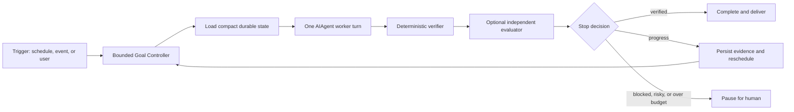

# Kabuqina Loop Engineering and Bounded Goal Runner Design

Date: 2026-06-27

Status: approved design; implementation is governed by
`docs/superpowers/plans/2026-06-27-bounded-goal-runner.md`.

## Executive decision

Kabuqina should adopt **loop engineering as an outer-loop discipline**, not as
a replacement for the agent's inner ReAct/LangGraph conversation engine.

The decision has two tracks:

1. **Development track — use now.** Apply a bounded maker/checker loop to the
   Phase 3.5 migration: one plan task per isolated worktree, deterministic
   verification, durable progress state, and a human merge gate.
2. **Product track — build in gated parallel lanes.** State, transition,
   verifier, reporting, controller, and read-only status foundations may be
   implemented while Phase 3.5 is in progress because they do not touch the
   conversation hot path. Runtime wiring waits for Phase 3.5's equivalence and
   selector gates; user exposure waits for its graph-default release soak. The
   resulting `mode: goal` extension performs one bounded worker iteration per
   scheduler wake, verifies evidence independently, persists compact state, and
   decides whether to complete, reschedule, or pause for a person.

The product feature is called **持续目标 / Goal Task** in the UI. “Loop
engineering” remains an internal architecture term.

This design does not add a new orchestration framework. It reuses Kabuqina's
cron scheduler, `AIAgent`, skills, tool policies, approvals, session store,
delivery bridge, and subagent support.

## What the term means

“Loop engineering” became a visible term in June 2026 for designing the system
that repeatedly prompts and supervises coding agents instead of manually
prompting them turn by turn. Addy Osmani describes five operating primitives —
automations, isolated worktrees, skills, connectors, and separate subagents —
plus durable state outside the model context.

The label is new; the underlying engineering is not. Earlier agent work already
established the load-bearing ideas:

- agents should observe ground truth from tools and stop under explicit limits;
- long-running work needs external progress artifacts across fresh contexts;
- an evaluator should be separate from the generator where practical;
- deterministic test oracles are stronger than the worker's claim that it is
  finished;
- permissions, artifacts, budgets, and human intervention belong to the
  environment around the agent.

This is an emerging practice rather than a formal standard. Even its advocates
warn about token cost, weak verification, comprehension debt, and unattended
mistakes.

Primary references:

- Addy Osmani, [Loop Engineering](https://addyosmani.com/blog/loop-engineering/)
- Anthropic, [Building effective agents](https://www.anthropic.com/engineering/building-effective-agents)
- Anthropic, [Effective harnesses for long-running agents](https://www.anthropic.com/engineering/effective-harnesses-for-long-running-agents)
- Anthropic, [Harness design for long-running application development](https://www.anthropic.com/engineering/harness-design-long-running-apps)
- Anthropic, [Long-running Claude for scientific computing](https://www.anthropic.com/research/long-running-Claude)
- EurekAgent, [Environment engineering for autonomous scientific discovery](https://arxiv.org/abs/2606.13662)

## Boundary: outer loop versus inner loop

The distinction is architectural, not semantic wordplay:



The **inner engine** executes one `AIAgent.run_conversation` turn. It may remain
the legacy loop or become LangGraph; the goal controller treats it as an opaque
port.

The **outer controller** owns cross-turn state, verification, budgets, retry
decisions, and human escalation. It must not import
`agent.graph_engine.*`, depend on LangGraph checkpoints, or duplicate the
conversation scheduler.

Therefore this design does not modify or supersede
`2026-06-24-consolidate-and-langgraph-replatform-plan.md`.

## Existing Kabuqina capability map

Kabuqina already contains four complete loop primitives and two partial ones:

| Loop primitive | Current capability | Assessment |
|---|---|---|
| Automation | `cron/jobs.py`, `cron/scheduler.py`, desktop cron ticker | Strong |
| Skills | Cron jobs accept ordered skills; core has built-in and optional skills | Strong |
| Connectors | Tool registry, MCP, gateway adapters, desktop delivery | Strong |
| Subagents | `tools/delegate_tool.py` plus parent/child budgets and progress events | Strong |
| Durable state | Job JSON, output documents, `SessionDB`, Todo store | Partial: no structured goal-run state or attempt history |
| Isolation | Workspace jail, per-job `workdir`, file write conflict checks | Partial: no per-iteration snapshot, rollback, or worktree adapter |

Additional safety foundations already exist:

- `IterationBudget` bounds one agent turn;
- `approval_backend.py` routes risky shell and messaging actions to Tauri;
- `tool_policy.py`, path policy, and network policy constrain capabilities;
- cron can run a pre-check script and skip the LLM with `wakeAgent=false`;
- cron stores outputs and can chain another job's latest output as context;
- desktop delivery already reports scheduled results to notifications and chat.

The main gaps are an independent verifier, a durable cross-run budget, an
explicit no-progress detector, and a state machine that distinguishes progress,
candidate completion, blocking, and verified completion.

## Alternatives considered

### A. Put the outer loop into LangGraph

Rejected for the first version. It would couple a simple durable state machine
to the dependency and migration risk of the inner engine, duplicate Hermes
session persistence, and blur rollback boundaries. The outer controller needs
atomic state transitions, not model-oriented graph checkpoints.

### B. Extend the existing cron system with `mode: goal`

Recommended. Cron already owns triggering, locking, delivery, profile-aware
paths, skills, toolsets, provider selection, and per-run sessions. A focused
goal controller can reuse those contracts without creating a second scheduler.

### C. Use loop engineering only as a development process

Useful immediately but incomplete as a product direction. It should be adopted
for Phase 3.5 regardless of whether Goal Tasks later ship to users.

## Track A — development loop for Phase 3.5

This track changes how the migration is executed, not application runtime code.

### Loop contract

Each cycle:

1. Reads the Phase 3.5 plan, git history, and a durable progress record.
2. Selects exactly one unchecked task whose prerequisites pass.
3. Creates or reuses an isolated worktree for that task.
4. Runs a maker agent to perform the smallest test-driven slice.
5. Runs deterministic commands from the plan.
6. Uses a fresh checker agent for spec and diff review when multi-agent execution
   is explicitly requested.
7. Records commands, exit codes, changed files, unresolved findings, and the
   next eligible task.
8. Stops for human review before merge, push, dependency-policy changes, golden
   fixture updates, or any failed gate waiver.

### Durable state

The loop state lives at:

`docs/superpowers/progress/phase-3.5-loop-state.json`

It records only orchestration state, not prompts or secrets:

```json
{
  "plan": "docs/superpowers/specs/2026-06-24-consolidate-and-langgraph-replatform-plan.md",
  "current_task": 1,
  "status": "ready",
  "attempt": 0,
  "worktree": null,
  "last_commit": null,
  "last_verification": [],
  "failed_approaches": [],
  "blocker": null,
  "next_action": "Run the dependency and bundled-runtime spike"
}
```

Allowed statuses are `ready`, `running`, `verifying`, `review_required`,
`blocked`, and `complete`.

The plan checkboxes and git commits remain the authoritative implementation
history. The progress file is a resumable cursor and evidence index; it cannot
mark a plan task complete without the plan's required commands passing.

### Stop rules

The development loop stops when any of these is true:

- the selected task passes and needs human review;
- a deterministic command fails twice with the same failure signature;
- the next attempt would repeat a recorded failed approach;
- files outside the task's declared scope must change;
- a dependency, architecture, golden-contract, or release gate needs judgment;
- the plan has no eligible unchecked task;
- the user interrupts or replaces the active objective.

The loop never auto-merges, pushes, changes a golden expectation, or weakens a
test to obtain a green result.

## Track B — product Bounded Goal Runner

### Product behavior

A Goal Task is a scheduled objective that can require several fresh agent turns.
One scheduler wake performs at most one worker iteration. It then verifies and
persists the result before another iteration may be scheduled.

This is intentionally slower than an unbounded in-process `while` loop. The
boundary gives Kabuqina a durable checkpoint, an approval opportunity, a cost
ledger, and a clean process-restart recovery point after every iteration.

User-facing examples:

- scan a workspace incrementally and maintain a verified learning-material
  inventory;
- monitor a folder for new course documents, process only changed files, and
  pause when a file cannot be read;
- in power-user mode, fix one failing test per iteration until the configured
  test oracle passes;
- periodically gather evidence for a research brief while keeping final
  publication behind human approval.

Open-ended creative work without a credible verifier is not a Goal Task. It
stays an interactive chat or ordinary cron agent job.

### Core placement

Agent and scheduling semantics belong in `hermes_core/`:

| File | Responsibility |
|---|---|
| `hermes_core/agent/usage_events.py` | Engine-neutral per-attempt usage/cost sink supplied by Phase 3.5. |
| `hermes_core/cron/goal_runner.py` | Execute one bounded iteration and return a state transition. |
| `hermes_core/cron/goal_state.py` | Validate, atomically persist, and recover mutable goal state. |
| `hermes_core/cron/goal_transitions.py` | Apply limits and reduce one observation to a pure state transition. |
| `hermes_core/cron/goal_verifiers.py` | Built-in deterministic verifiers and read-only evaluator port. |
| `hermes_core/cron/goal_report.py` | Hold one iteration-scoped worker report in a `ContextVar`. |
| `hermes_core/cron/goal_agent_worker.py` | Call public `AIAgent.run_conversation` without importing either inner engine. |
| `hermes_core/cron/goal_controls.py` | Serialize pause, resume, cancel, and delete through core state rules. |
| `hermes_core/cron/jobs.py` | Backward-compatible `mode: goal` job definition and defaults. |
| `hermes_core/cron/scheduler.py` | Route due goal jobs through `goal_runner`; reuse delivery and locking. |
| `hermes_core/tools/cronjob_tools.py` | Create, inspect, pause, resume, and cancel Goal Tasks. |
| `hermes_core/tools/goal_report_tool.py` | Register the non-default `goal_internal` report toolset. |

Desktop-only surfaces stay outside core:

| File area | Responsibility |
|---|---|
| `python/overlays/cron_desktop_delivery.py` | Deliver terminal and explicitly configured progress transitions exactly once. |
| `python/src/desk_server/` | Expose authenticated host-profile controls that delegate to core transition services. |
| `tauri/src/cron.rs` | Project sanitized host-profile goal status through the existing cron commands. |
| `web/src/advanced/pages/ScheduledTasks.tsx` | Show progress and controls; add creation only after the product-rollout gate. |

No scheduling or verifier semantics belong in an overlay or React component.

### Backward-compatible job definition

Existing jobs remain valid: missing `mode` continues to mean `agent`; `notify`
is unchanged. A goal job adds fields with safe defaults:

```json
{
  "mode": "goal",
  "goal": "Keep the learning-material inventory complete and valid",
  "prompt": "Process one unindexed or changed supported file",
  "schedule": {
    "kind": "interval",
    "minutes": 10,
    "display": "every 10m"
  },
  "skills": ["ocr-and-documents", "powerpoint"],
  "enabled_toolsets": ["file"],
  "workdir": "C:\\Users\\student\\Documents\\KabuqinaWork",
  "verifier": {
    "kind": "manifest_complete",
    "config": {
      "manifest": "learning-materials.json",
      "roots": ["materials"],
      "extensions": [".pdf", ".docx", ".pptx"]
    }
  },
  "limits": {
    "max_runs": 40,
    "max_cost_usd": "5.00",
    "max_wall_seconds": 14400,
    "deadline": null,
    "no_progress_limit": 3,
    "max_infrastructure_failures": 3
  },
  "approval_mode": "ask_before_external_side_effect",
  "deliver": "origin"
}
```

`goal`, `verifier`, and `limits` are required for `mode: goal`. Toolsets remain
fixed for the lifetime of a run unless the user pauses and edits the job; this
preserves prompt-cache and safety assumptions.

Pilot 1 declares only the `file` toolset in the persisted job. The runtime
adapter adds the non-default `goal_internal` report toolset without broadening
the profile policy. The canonical pre-exposure contract is frozen in
`hermes_core/tests/cron/fixtures/goal_manifest_pilot/pilot-definition.json`;
tests must fail if its verifier, roots, extensions, toolset, 40-run / four-hour /
USD 5.00 limits, or pause thresholds drift.

### Mutable state and evidence

Job definitions stay in the existing cron job store. Mutable state is separated
so frequent writes do not churn the definition file:

```text
%HERMES_HOME%/cron/goal-runs/<job-id>/state.json
%HERMES_HOME%/cron/goal-runs/<job-id>/iterations/<iteration>/report.json
%HERMES_HOME%/cron/goal-runs/<job-id>/iterations/<iteration>/verification.json
%HERMES_HOME%/cron/goal-runs/<job-id>/iterations/<iteration>/transition.json
%HERMES_HOME%/cron/output/<job-id>/<timestamp>.md
```

All paths derive from `get_hermes_home()`. State writes use a temp file plus
atomic replace under the existing cron lock. On startup, a leftover temp file is
ignored; the last complete `state.json` remains authoritative. Per-iteration
records use exclusive creation and are immutable. The report and usage are
committed before verification; verification and transition records are appended
after their corresponding steps.

The state schema is:

```json
{
  "schema_version": 1,
  "job_id": "abc123def456",
  "status": "scheduled",
  "iteration": 0,
  "started_at": null,
  "updated_at": null,
  "completed_at": null,
  "accumulated_cost_usd": "0.0",
  "cost_accounting": "complete",
  "accumulated_wall_seconds": 0.0,
  "no_progress_count": 0,
  "infrastructure_failures": 0,
  "last_evidence_hash": null,
  "last_summary": null,
  "last_verifier_outcome": null,
  "pause_reason": null,
  "last_error": null
}
```

Allowed statuses are `scheduled`, `running`, `verifying`, `completed`,
`paused`, `failed`, and `cancelled`.

Every iteration uses a fresh cron session id. The worker receives only the goal,
stable constraints, compact state, the last verifier feedback, and references
to artifacts. It does not receive every previous conversation transcript.

### Worker report contract

The worker must end by calling an internal goal-report port available only in a
Goal Task session. The report is structured:

```json
{
  "status": "progress",
  "summary": "Indexed one changed PDF file",
  "artifacts": ["learning-materials.json"],
  "evidence": {"manifest_entries_before": 18, "manifest_entries_after": 19},
  "next_step": "Process the remaining DOCX file",
  "external_side_effects": []
}
```

Allowed worker statuses are `progress`, `candidate_done`, and `blocked`.
Missing or invalid reports fail the iteration; free-form assistant confidence
never completes a goal.

The internal report port records data only. It cannot change the job definition,
raise limits, expand toolsets, approve an action, or mark the goal verified.

### Usage and cost ledger

The normal `run_conversation` result currently includes numeric
`estimated_cost_usd`, token totals, `cost_status`, and `cost_source`. Most early
exit dictionaries do not. More importantly, several truncation exits return
before the loop's existing session counters and session DB update consume the
response usage. The Goal Runner therefore does not treat the result dictionary,
agent instance totals, or session DB row as a complete per-iteration ledger.

Phase 3.5 introduces an engine-neutral side channel in
`hermes_core/agent/usage_events.py`. `AIAgent` accepts an optional usage sink;
the loop and graph transport adapters emit exactly one event for every main or
agent-owned auxiliary model attempt before any response branch can return. This
includes context-compression and max-iteration summary calls, not only the main
conversation transport. An event records:

- attempt index and outcome (`response`, `invalid_response`, or
  `transport_error`);
- provider, model, base URL, and API mode active for that attempt;
- normalized input, output, cache-read, cache-write, and reasoning tokens when
  the provider supplies usage;
- `CostResult.amount_usd`, status, source, and pricing version from the existing
  `agent.usage_pricing` logic.

The sink is `None` for ordinary callers and does not add or remove result keys.
Goal Task iterations inject a fresh in-memory `UsageLedger` and persist its
sanitized events in `report.json`. The ledger, not the result dictionary, is the
authoritative source for the iteration cost.

An optional independent evaluator uses a separate ledger that is merged into the
same iteration record before limits are applied. Pilot 1 disables subagents and
tools that make separately billed model/API calls. They remain unavailable to
Goal Tasks until they propagate the usage sink or define their own complete cost
event contract; a main-agent ledger cannot claim to cap charges it cannot see.

Cost completeness is fail-closed:

- zero transport attempts is a complete known cost of zero;
- `actual`, `estimated`, and `included` events with numeric amounts are summed;
- any attempted request with missing usage or unknown pricing makes the
  iteration cost incomplete;
- an incomplete ledger is never attributed as zero and never passes
  `max_cost_usd`; the task pauses with `cost_unknown` before verification or
  completion;
- Pilot 1 validates the primary and fallback pricing routes before its first
  worker turn so unknown-cost pauses are exceptional rather than routine.

The state keeps the sum of complete prior/current amounts in
`accumulated_cost_usd` and records `cost_accounting` as `complete` or
`incomplete`. A future provider reconciliation may replace an estimate with an
actual charge only through a separately versioned ledger event; it must not
silently rewrite old iteration evidence.

### Verification model

Verification is tiered:

1. **Deterministic verifier:** required. Checks artifacts, schemas, manifests,
   hashes, command exit codes, or another domain-specific oracle.
2. **Independent evaluator:** optional. A fresh read-only agent evaluates a
   semantic rubric and returns pass/fail, confidence, and reasons. It receives
   evidence, not the worker's hidden reasoning.
3. **Human gate:** required before publication, remote messaging, permission
   expansion, destructive changes, or acceptance of a soft-only result.

Initial built-in verifier kinds:

| Kind | Use | Availability |
|---|---|---|
| `artifact_exists` | Required paths exist and remain inside allowed roots | All users |
| `json_schema` | JSON artifact validates against a fixed schema | After an explicit bundle-dependency gate |
| `manifest_complete` | Manifest covers supported files and required fields | All users |
| `content_hash_changed` | Evidence changed since the previous iteration | All users |
| `test_command` | An allowlisted test command exits successfully | Power user only |
| `llm_rubric` | Independent read-only semantic evaluation | Optional secondary gate only |

Arbitrary shell text is not a verifier for ordinary users. `test_command` uses
the existing approval backend, command safety checks, workspace restrictions,
and an explicit allowlist stored in the job definition.

Pilot 1 implements `artifact_exists`, `manifest_complete`, and
`content_hash_changed` without a new dependency. Generic `json_schema` is
reserved but not required for the pilot: the desktop requirements currently
receive its library only transitively through `mcp`, not through an explicit core
or desktop declaration. It must pass a separate explicit bundle-dependency gate;
Kabuqina will neither rely on that transitive accident nor ship a partial
home-grown JSON Schema interpreter.

### State transition rules

The controller applies transitions in this order:

1. Validate job definition and load state.
2. Enforce deadline, run-count, previously accumulated cost, wall-time, and
   cancellation limits before calling a model.
3. Run one worker turn with the job's fixed skills and toolsets.
4. Persist the worker report and complete usage-event ledger before verification.
5. If cost accounting is incomplete, persist `paused/cost_unknown` and stop.
   Otherwise add the iteration amount and enforce `max_cost_usd`.
6. Run the deterministic verifier.
7. Run the independent evaluator only when configured and deterministic checks
   have not failed.
8. Compute a stable evidence hash from deterministic signals only: the sorted
   content hashes of the declared artifacts plus the deterministic verifier's
   `outcome` and canonicalized `evidence`. Model-authored report fields
   (`summary`, `next_step`, and the worker's self-reported `evidence`) are
   excluded so the hash reflects real change, not regenerated prose.
9. Transition:
   - verified `candidate_done` → `completed`;
   - evidence changed and limits remain → `scheduled`;
   - `blocked`, approval required, invalid verifier, or repeated evidence →
     `paused`;
   - unrecoverable state corruption → `failed`;
   - user cancellation → `cancelled`.
10. Persist state atomically, then deliver the transition summary.

Only the controller sets `completed`.

### No-progress detection

The evidence hash includes only sorted declared-artifact content hashes and the
canonical deterministic verifier outcome/evidence. It excludes the worker's
`summary`, `next_step`, self-reported `evidence`, all other model prose,
timestamps, cost, usage, and iteration number. Repeating the same hash increments
`no_progress_count`; changed deterministic evidence resets it.

At `no_progress_limit`, the task pauses with the last reports and verifier
feedback. It does not ask the same model to try the same strategy indefinitely.

An operator may resume after changing the prompt, verifier, tool scope, limits,
or state. Resume records which field changed.

### Budgets

The existing per-turn `IterationBudget` remains in force. Goal Tasks add
cross-run limits:

- maximum worker runs;
- accumulated normalized LLM cost from complete usage-ledger events;
- accumulated active wall time;
- optional deadline;
- no-progress count;
- maximum consecutive infrastructure failures.

Budget exhaustion pauses rather than fails the goal. Increasing a limit is a
user action and is recorded in evidence history.

Incomplete cost accounting also pauses rather than failing or assuming zero.
Resume requires a known pricing route or an explicit, audited manual cost
attribution for the paused iteration.

### Side effects and approvals

Goal Tasks inherit the current path, network, tool, and approval policies. They
add these rules:

- Pilot 1 toolsets are exactly `file` plus `goal_internal`; later templates may
  add policy-approved tools only after their side effects and separately billed
  calls are covered by the goal ledger;
- a Goal Task cannot create another Goal Task;
- toolsets and skills cannot expand while an iteration is running;
- an independent evaluator receives read-only tools;
- a failed verifier never rolls back an external side effect by guessing;
- a turn is never automatically replayed after a possibly non-idempotent tool;
- remote messaging, publication, shell mutation, and writes outside the
  workspace require their existing approvals plus the job's approval policy;
- secret values never enter state, evidence, prompts, or delivery summaries.

Where an external API supports idempotency keys, derive one from job id,
iteration, tool-call id, and normalized arguments. Otherwise pause after an
ambiguous timeout rather than retrying.

### Process and profile model

Cron ownership is **per `HERMES_HOME`**, matching current behavior:

- the desktop web child ticks jobs in the host
  `%LOCALAPPDATA%\com.kabuqina.app\hermes-home`;
- each gateway child ticks jobs in its own
  `hermes-home/profiles/<platform>`;
- the existing `.tick.lock` ensures one active ticker for each profile store.

A Goal Task definition, mutable state, evidence, approvals, and delivery target
all belong to one profile. Processes must not read or execute another profile's
Goal Tasks, and the host UI must not pretend that gateway-profile state is part
of the host store.

Pilot 1 creates host-profile Goal Tasks through the desktop UI and therefore
runs in the web child. Gateway-profile creation remains disabled during the
first release. Gateway enablement requires a separate plan; when eventually
enabled, a Goal Task created through a gateway must belong to that gateway
profile, be executed by that profile's ticker, and be controlled through the
same originating profile.

Goal state is process-independent within its profile. Restarting the owning
Python child resumes from the last complete state and never reconstructs
progress from in-memory objects.

### UI and delivery

Extend the existing Scheduled Tasks screen rather than adding a second
automation product.

The first UI exposes:

- goal and one-step worker instruction;
- schedule and allowed toolsets;
- verifier kind and verifier-specific fields;
- run, cost, wall-time, and no-progress limits;
- status, iteration, cost plus accounting completeness, last evidence hash, and
  pause reason; incomplete cost is never displayed as zero;
- pause, resume, cancel, and terminal-only delete actions.

Run-now and open-artifact actions are deferred. Run-now needs an explicit
schedule/approval contract, and artifact opening needs the separately reviewed
redaction and retention API described below.

Do not build a node graph editor, arbitrary workflow language, or plugin
marketplace in the first version.

Desktop delivery occurs only for completion, pause, failure, cancellation, or a
user-selected periodic progress cadence. Normal intermediate iterations stay in
the task detail view to avoid notification spam.

## Pilot sequence

### Pilot 0 — development loop

Use Track A on Phase 3.5 while the product's pure foundations are developed in
parallel. Runtime scheduling and `AIAgent` integration remain gated. Success
means the loop completes plan tasks incrementally without weakening tests,
modifying goldens without review, or merging automatically.

### Pilot 1 — read-mostly workspace inventory

The first product pilot maintains `learning-materials.json` for supported files
under one selected workspace directory.

Constraints:

- only `file` plus the internal goal-report toolset at runtime; no network,
  browser, messaging, terminal, code execution, subagents, vision, image
  generation, TTS, or other separately billed tool;
- host profile and web-child execution only;
- file reads plus one manifest write inside the workspace;
- one changed or missing file processed per iteration;
- deterministic `manifest_complete` verifier;
- maximum 40 runs, four hours, and a configurable cost cap;
- pause on unreadable files, schema errors, repeated evidence, or approval need.

This pilot exercises durable state, restart recovery, budgets, verification,
and UI without exposing irreversible external actions.

#### Implemented G2 creation and control boundary (2026-07-12)

The first exposed product surface is deliberately narrower than the generic
core job record. The authenticated desktop route accepts no creation body: it
derives the spawned web child's `HERMES_WORKSPACE` and calls
`cron.goal_pilot.create_pilot_manifest_goal`. That core helper delegates to
`create_job` with the frozen `manifest_complete` definition, `deliver: local`,
the persisted `file` allowlist, 40-run/four-hour/USD 5.00 limits, and the
standard no-progress/infrastructure thresholds. Rust proxies this through
`cmd_goal_create`; the webview never receives a desk port, auth token, or a
chance to provide arbitrary verifier JSON, a different workspace, a delivery
target, or changed limits.

Creating a Goal Task seeds its authoritative `scheduled` state before the first
wake. Thus pause, resume, cancel, and terminal delete remain the core-owned
`goal_controls` transitions even for a just-created task. The definition is
immutable after creation. A public tool creation rejects an active
`goal_internal` scope and gateway profiles; it accepts only local delivery and
the persisted `file` toolset for Pilot 1. The desktop approval bridge continues
to obtain the existing cron confirmation for agent-requested creation and
preserves Goal fields without expanding local delivery to remote channels.

The Scheduled Tasks card requires an explicit confirmation showing the selected
workspace, one-iteration-per-wake cadence, file plus manifest boundary, limits,
and host-only scope. Its pause/resume confirmation explains billing behavior;
cancel preserves work; terminal delete removes the job definition/card but
retains goal-run evidence. Control errors are visible in the card and durable
pause reasons use localized user copy. These implementation checks do not count
as Pilot 1 runtime evidence.

### Pilot execution harness

`hermes_core/scripts/run_goal_manifest_pilot.py` is the constrained harness for
the synthetic half of Task 10. It accepts no arbitrary task definition: every
run copies the frozen `goal_manifest_pilot` fixture into a new disposable
directory, removes exactly the fixture's `materials/lesson.docx` manifest
record, and persists a `file`-only Goal Task with the frozen
`manifest_complete`, 40-run, four-hour, USD 5.00 limits.

Prepare one independent profile/workspace for each engine, then wake each one
once per intended scheduler wake. An optional `--config` copies only a selected
non-secret `config.yaml`; the harness never copies `.env` or credentials. A
real wake receives credentials only through the normal process environment.

```powershell
cd hermes_core
python scripts/run_goal_manifest_pilot.py prepare `
  --engine loop --run-dir $env:TEMP\kabuqina-goal-pilot\loop `
  --config C:\path\to\disposable-config.yaml
python scripts/run_goal_manifest_pilot.py prepare `
  --engine graph --run-dir $env:TEMP\kabuqina-goal-pilot\graph `
  --config C:\path\to\disposable-config.yaml

# Only after G2 opens; repeat at most once for each intended scheduler wake.
python scripts/run_goal_manifest_pilot.py wake `
  --run-dir $env:TEMP\kabuqina-goal-pilot\loop
python scripts/run_goal_manifest_pilot.py wake `
  --run-dir $env:TEMP\kabuqina-goal-pilot\graph

python scripts/run_goal_manifest_pilot.py compare `
  --loop-run-dir $env:TEMP\kabuqina-goal-pilot\loop `
  --graph-run-dir $env:TEMP\kabuqina-goal-pilot\graph
```

The comparison reads and emits only controller transition fields, verifier
outcomes, and artifact hashes; it deliberately omits prompts, agent output,
document contents, report summaries, and verifier evidence. It always requires
manual review and does not itself declare pilot success.

**Synthetic dual-engine result (2026-07-12).** The constrained fixture
completed one explicit wake under graph (`0b7059146639`) and loop
(`1d76d83f1afb`). Both transitions were `running → completed` with reason
`verified_complete`; both verifier outcomes were `pass`; both emitted artifact
hash `37df380328a2215933f1a0a6b1fe7ad43f0d0d2fe4c451d6c5f353da6f68adcc`; and
both ledgers were complete. The comparison contains only these durable fields.
The temporary host activation used while diagnosing the desktop route was
restored to disabled; it did not count as an enablement decision or as the
human-selected workspace pilot.

### Pilot exit criteria

All must hold before enabling Goal Tasks outside a developer flag:

- 30 consecutive completed or correctly paused pilot runs;
- at least five app/Python-child restarts during active goals with exact state
  recovery;
- every run stops within configured limits;
- zero writes outside the selected workspace and profile data directory;
- zero secret values in state, evidence, output, or logs;
- zero duplicate non-idempotent effects;
- no manually identified false completion;
- accumulated tokens and cost equal the sum of complete per-attempt ledger
  events, and every incomplete ledger pauses as `cost_unknown`;
- old `agent` and `notify` cron jobs remain behaviorally unchanged.

## Testing strategy

### Core unit tests

Place behavior tests under `hermes_core/tests/cron/`:

- old jobs default to `mode: agent`;
- goal definition validation and safe defaults;
- every valid and invalid state transition;
- atomic state recovery after interrupted writes;
- fresh-session context construction;
- report schema rejection;
- deterministic verifier pass/fail/error behavior;
- evidence hashing and no-progress pause;
- run, cost, wall-time, deadline, and infrastructure-failure limits;
- normal and early-exit usage events, unknown-pricing pause, and no zero-cost
  attribution for incomplete attempts;
- cancellation and resume audit history;
- no nested cron/goal creation;
- no automatic replay after ambiguous side effects;
- single-executor locking across process-shaped tests.

### Desktop integration tests

Place integration tests under `python/tests/`:

- scheduler transition delivery reaches the desktop bridge;
- completion, pause, failure, and cancel appear in chat exactly once;
- proxy and loopback policies remain unchanged;
- host and gateway profiles never read or execute each other's Goal Tasks;
- one ticker wins the lock when two process-shaped executors target the same
  test profile.

Rust tests separately prove that the existing Tauri cron projection exposes only
sanitized host-profile state and that control commands proxy to authenticated
core-backed endpoints rather than implementing transitions in Rust.

### Web tests

At the foundation gate, cover live status, pause/resume, budget display, and
destructive cancel confirmation. Add creation-form and verifier-field tests only
after the product-rollout gate opens.

### Runtime smoke

The release-build smoke runs Pilot 1 through completion, restarts the app
mid-goal, verifies the manifest manually, and confirms legacy notify and agent
jobs still run.

## Observability

One structured INFO log is emitted for every transition:

```text
goal_transition job=<id> iteration=<n> from=<state> to=<state>
reason=<reason> cost=<total> evidence=<short-hash>
```

Logs never include prompts, raw document contents, secrets, or full verifier
evidence. The initial detail view projects sanitized state only. Raw evidence
stays profile-local until a separately reviewed evidence API defines redaction
and retention.

Metrics recorded locally per goal:

- iterations and retries;
- worker and evaluator model usage;
- deterministic verifier duration;
- active wall time;
- transition counts;
- pause and failure reasons;
- approval requests and outcomes;
- repeated-evidence count.

No new telemetry leaves the device.

## Rollback and failure policy

- The product feature starts behind `cron.goal_loop.enabled: false`.
- Disabling the feature prevents new iterations but preserves state and lets
  users inspect, export, cancel, or delete existing goals.
- Goal state schema migrations are forward-only, versioned, and tested against
  retained v1 fixtures.
- If a controller bug is found, pause affected jobs; do not reinterpret their
  evidence or replay their last worker turns automatically.
- Removing `mode: goal` support must not change legacy job loading or delivery.
- The feature does not become a release blocker for Phase 3.5: pure foundations
  can land independently, runtime wiring waits for equivalence plus selector,
  and product exposure waits for the inner-engine soak.

## Accepted gates for implementation

The implementation plan may proceed under all of these accepted constraints:

- the inner/outer loop boundary remains as defined here;
- `mode: goal` extends cron rather than introducing a new scheduler;
- one worker iteration per scheduler wake is acceptable;
- deterministic verification is mandatory;
- `llm_rubric` cannot be the sole gate for risky completion;
- Pilot 1 is the first product slice;
- pure product foundations may develop beside Phase 3.5;
- runtime integration starts only after Phase 3.5 full equivalence and selector;
- user-facing creation and enablement start after Phase 3.5's release soak;
- no new orchestration dependency is introduced.

The three concrete gates, file ownership, test commands, and merge order are in
`docs/superpowers/plans/2026-06-27-bounded-goal-runner.md`.
